# Software Requirements Specification  
## Transformable Narrative Graph System

**Document version:** 1.0  
**Date:** 2026-04-26  
**Prepared by:** Matt Briggs  
**Standard:** IEEE 830-1998 (adapted for Markdown + Mermaid.js)

---

## Table of Contents

1. [Introduction](#1-introduction)
2. [Overall Description](#2-overall-description)  
3. [System Architecture](#3-system-architecture)  
4. [Data Model and Graph Schema](#4-data-model-and-graph-schema)  
5. [Input Specification](#5-input-specification)  
6. [Graph Construction Pipeline](#6-graph-construction-pipeline)  
7. [Transformation Engine](#7-transformation-engine)  
8. [Output Specification](#8-output-specification)  
9. [Functional Requirements](#9-functional-requirements)  
10. [External Interface Requirements](#10-external-interface-requirements)  
11. [Non-Functional Requirements](#11-non-functional-requirements)  
12. [UML Descriptions](#12-uml-descriptions)  
13. [Security Requirements](#13-security-requirements)  
14. [Testing Requirements](#14-testing-requirements)  
15. [Operational Requirements](#15-operational-requirements)  
16. [Constraints and Limitations](#16-constraints-and-limitations)  
17. [Appendix: Cypher Schema Reference](#17-appendix-cypher-schema-reference)

---

## 1. Introduction

### 1.1 Purpose

This Software Requirements Specification (SRS) defines the functional, non-functional, interface, security, and operational requirements for the **Transformable Narrative Graph System** (TNGS). It is intended as both a design blueprint for implementers and a proof-of-concept specification demonstrating that the literary-theoretical model described in the companion white paper is operationally real.

### 1.2 Scope

TNGS is a graph-native software system that:

- Accepts free-form literary notes and source texts as input
- Segments them into atomic narrative units, events, characters, and patterns
- Stores the resulting structure as a property graph in Neo4j
- Applies literary transformations (point of view, mood, genre, chronotope, reliability, and Barthesian code overlay) as auditable graph operations
- Renders transformed graph states back into prose drafts, summaries, or structured analytic outputs

The system does **not** claim to solve prose style automatically. The graph controls structure, causality, focalization, and transformation lineage; stylistic realization is the responsibility of the rendering layer.

### 1.3 Definitions, Acronyms, and Abbreviations

| Term | Definition |
|---|---|
| **Atom** | The minimal expressive narrative unit — a clause or sentence that cannot be meaningfully subdivided without loss of narrative function |
| **Pattern** | A named, reusable template describing a recurring narrative arrangement (e.g., "Gift Exchange", "Threshold Crossing") |
| **PatternInstance** | A concrete realization of a Pattern within a specific Scene |
| **Transformation** | A graph operation that alters the interpretation axis of a scene or narrative (POV, mood, genre, chronotope, reliability, code) without necessarily discarding prior state |
| **Focalization** | The cognitive and emotional perspective through which events are filtered, following Genettean narratology |
| **Chronotope** | A Bakhtinian concept encoding the intrinsic relationship between time and space in a narrative |
| **CodeTag** | A Barthesian narrative code attached to an atom (hermeneutic, proairetic, semic, symbolic, cultural) |
| **TNGS** | Transformable Narrative Graph System |
| **POV** | Point of View |
| **SRS** | Software Requirements Specification |
| **KG** | Knowledge Graph |
| **API** | Application Programming Interface |

### 1.4 Overview

Section 2 situates the system in context. Sections 3–8 define architecture, data model, and pipeline. Sections 9–11 state formal requirements. Section 12 provides UML descriptions for every major diagram. Sections 13–15 address security, testing, and operations. Section 16 states known limits.

---

## 2. Overall Description

### 2.1 Product Perspective

TNGS is a self-contained, containerized system. It has no mandatory dependency on external AI providers, cloud services, or proprietary data formats. It is designed for digital-humanities practitioners, computational narratologists, experimental writers, and knowledge-graph engineers.

The system is positioned as a **reference implementation** of the theory described in the white paper: narrative decomposed into atoms, assembled into patterns, stored as an explicit graph, and transformed along defined literary axes.

### 2.2 Product Functions Summary

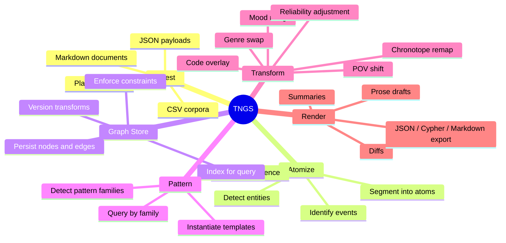

**Diagram 1 — System Function Map.** This mind map shows the six top-level functional domains of TNGS and the operations within each. Ingest and Atomize are pipeline entry points; Graph Store is the persistent state layer; Pattern and Transform are the core computational domains; Render produces all outputs.

### 2.3 User Classes

| Class | Description | Primary Interactions |
|---|---|---|
| **Author/Practitioner** | Writes notes, applies transforms, reviews prose outputs | Ingest, Transform, Render APIs |
| **Narratologist/Analyst** | Queries patterns, inspects transformation lineage, exports corpora | Pattern query, Export, Diff APIs |
| **System Administrator** | Manages deployment, backups, schema migrations, security | Ops runbooks, Admin CLI, Backup API |
| **Developer** | Extends renderers, adds transformation operators, writes tests | All layers |

### 2.4 Operating Environment

- **Container runtime:** Docker Engine 26+, Docker Compose v2
- **Graph database:** Neo4j 2026.04.0 Community or Enterprise
- **Application runtime:** Python 3.12+
- **Web framework:** FastAPI 0.115+
- **Development OS:** macOS, Linux
- **Production OS:** Linux (container host)

### 2.5 Design and Implementation Constraints

- All secrets must be injected from files or platform secret stores; no plaintext credentials in source or committed Compose files
- The graph schema must be versioned and applied through reviewed migration scripts
- The system must remain provider-neutral; no mandatory dependency on any single LLM vendor
- Annotation ambiguity is a first-class data concern; the schema must support confidence fields and must not force false certainty

### 2.6 Assumptions and Dependencies

- Neo4j Community Edition is the baseline; Enterprise features (online backup, clustering, RBAC) require an upgrade path
- The rendering layer is pluggable; the core graph layer does not depend on any template engine or LLM
- Pattern templates are explicitly modeled first; automated subgraph mining from large corpora is a future extension

---

## 3. System Architecture

### 3.1 Component Overview

```mermaid
flowchart TD
    subgraph Input["Input Layer"]
        A1[Plain text / Markdown]
        A2[JSON payload]
        A3[CSV corpus]
    end

    subgraph Ingest["Ingest & Atomization Service"]
        B1[Text segmenter]
        B2[Entity extractor]
        B3[Event detector]
        B4[Annotation tagger]
        B5[Pattern detector]
    end

    subgraph API["REST API — FastAPI"]
        C1[/v1/notes/import]
        C2[/v1/narratives]
        C3[/v1/patterns]
        C4[/v1/transforms/apply]
        C5[/v1/render]
        C6[/v1/health]
    end

    subgraph Domain["Domain Services"]
        D1[Ingest Service]
        D2[Pattern Service]
        D3[Transform Service]
        D4[Render Service]
    end

    subgraph Repo["Repository Layer"]
        E1[Graph Repository]
        E2[Cypher Query Builder]
    end

    subgraph Store["Graph Store"]
        F1[(Neo4j)]
    end

    subgraph Output["Output Layer"]
        G1[Prose draft]
        G2[Transformation diff]
        G3[JSON export]
        G4[Cypher export]
        G5[Markdown summary]
    end

    A1 & A2 & A3 --> C1
    C1 --> D1 --> B1 & B2 & B3 & B4 & B5
    B1 & B2 & B3 & B4 & B5 --> E1
    C2 & C3 --> D2 --> E1
    C4 --> D3 --> E1
    C5 --> D4 --> E1
    E1 --> E2 --> F1
    D4 --> G1 & G2 & G3 & G4 & G5
    C6 --> F1
```

**Diagram 2 — Component Architecture.** This flowchart shows the full system from input to output. The REST API is the single entry point for all external interactions. Domain Services encapsulate business logic and delegate persistence to the Repository Layer. The Repository Layer translates domain operations into Cypher queries against Neo4j. The Render Service reads graph state and produces all output formats.

### 3.2 Deployment Topology

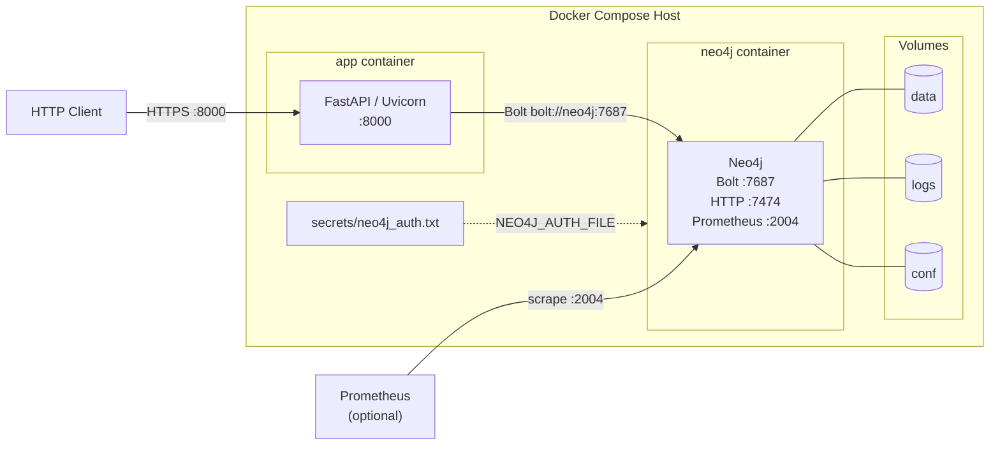

**Diagram 3 — Deployment Topology.** TNGS runs as two containers in a Compose stack. The `app` container runs FastAPI and communicates with `neo4j` over the internal Compose network using Bolt. Neo4j credentials are injected from a mounted secret file, never from environment variables or committed configuration. Prometheus scraping of Neo4j metrics is optional and must not be exposed publicly.

---

## 4. Data Model and Graph Schema

### 4.1 Node Labels

| Label | Key Properties | Purpose |
|---|---|---|
| `Narrative` | `id`, `title`, `status`, `source_ref` | Top-level work or draft |
| `Scene` | `id`, `sequence`, `summary` | Bounded narrative segment |
| `Atom` | `id`, `text`, `kind`, `surface_order`, `confidence` | Minimal expressive unit |
| `Event` | `id`, `verb`, `tense`, `aspect`, `confidence` | Action-bearing unit |
| `Character` | `id`, `name`, `role` | Participants and focalizers |
| `Pattern` | `id`, `name`, `family`, `description` | Reusable narrative template |
| `PatternInstance` | `id`, `slot`, `confidence` | Concrete realization of a Pattern |
| `Perspective` | `id`, `focalizer`, `distance`, `reliability` | POV state at a point in transform history |
| `MoodState` | `id`, `label`, `valence`, `arousal` | Affective/tonal state |
| `GenreProfile` | `id`, `name`, `conventions` | Genre encoding |
| `Chronotope` | `id`, `time_mode`, `space_mode` | Bakhtinian time-space frame |
| `CodeTag` | `id`, `code`, `label` | Barthesian code attachment |
| `Transform` | `id`, `axis`, `operator`, `applied_at`, `parameters` | Transformation event and lineage record |

### 4.2 Relationships

| Relationship | From → To | Meaning |
|---|---|---|
| `HAS_SCENE` | `Narrative → Scene` | Narrative contains this scene |
| `CONTAINS` | `Scene → Atom \| Event \| PatternInstance` | Scene contains this unit |
| `INSTANCE_OF` | `PatternInstance → Pattern` | This instance realizes that template |
| `REALIZES` | `PatternInstance → Atom \| Event` | Instance is grounded in these atoms/events |
| `PARTICIPATES_IN` | `Character → Event` | Character takes part in event |
| `CAUSES` | `Event → Event` | Direct causal relation |
| `ENABLES` | `Event → Event` | Enabling (necessary but not sufficient) |
| `PREVENTS` | `Event → Event` | Blocking or counterfactual relation |
| `PRECEDES` | `Event → Event` | Temporal ordering without causal claim |
| `CURRENT_PERSPECTIVE` | `Scene → Perspective` | Active POV for this scene |
| `CURRENT_MOOD` | `Scene → MoodState` | Active mood for this scene |
| `CURRENT_GENRE` | `Scene → GenreProfile` | Active genre profile for this scene |
| `IN_CHRONOTOPE` | `Scene → Chronotope` | Active time-space frame |
| `TAGGED_AS` | `Atom → CodeTag` | Barthesian code label on atom |
| `APPLIED_TO` | `Transform → Scene \| Narrative` | Where this transform was applied |
| `PRODUCED` | `Transform → Perspective \| MoodState \| GenreProfile \| PatternInstance` | What this transform created |

### 4.3 Entity Relationship Diagram

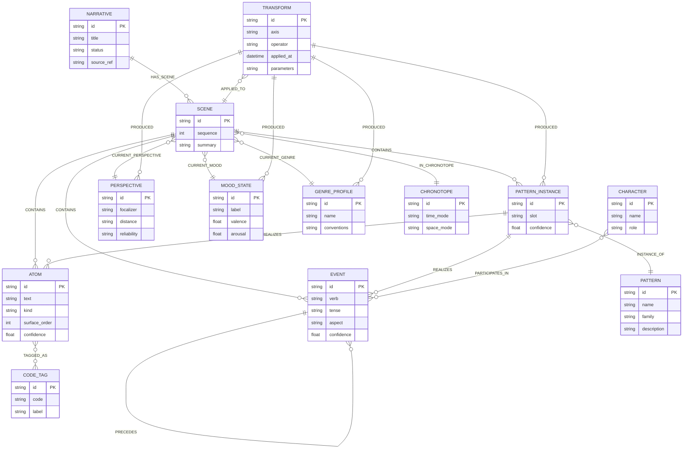

**Diagram 4 — Entity Relationship Diagram.** This ER diagram shows all node types and the named relationships between them. The `Transform` node is the audit trail: every transformation operation creates a new `Transform` node linked to both the scene it modified and the new state node it produced. This preserves full lineage without destructive overwrites.

### 4.4 Class Diagram (Domain Model)

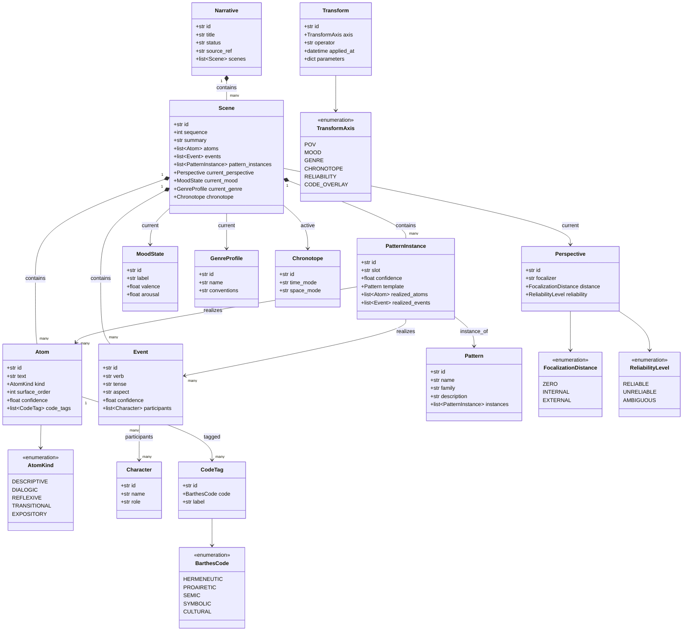

**Diagram 5 — Domain Class Diagram.** This class diagram reflects the Python domain model that mirrors the graph schema. Enumeration types (`AtomKind`, `BarthesCode`, `TransformAxis`, `FocalizationDistance`, `ReliabilityLevel`) constrain the vocabulary for their respective fields, enforcing bounded sets that prevent unconstrained free-text in critical semantic positions.

---

## 5. Input Specification

### 5.1 Accepted Input Formats

| Format | MIME type | Description |
|---|---|---|
| Plain text | `text/plain` | Unstructured notes or draft prose |
| Markdown | `text/markdown` | Structured notes with headings, lists |
| JSON payload | `application/json` | Pre-structured or partially annotated input |
| CSV | `text/csv` | Bulk corpus load for larger note sets |

### 5.2 JSON Payload Schema

A structured ingest payload must conform to the following schema:

```json
{
  "narrative_id": "string (optional — generated if absent)",
  "title": "string",
  "source_ref": "string (optional)",
  "scenes": [
    {
      "scene_id": "string (optional)",
      "sequence": "integer",
      "summary": "string",
      "text": "string — raw prose to be atomized",
      "annotations": {
        "pattern_hints": ["string"],
        "character_refs": ["string"],
        "code_tags": [
          { "atom_index": "integer", "code": "HERMENEUTIC | PROAIRETIC | SEMIC | SYMBOLIC | CULTURAL" }
        ]
      }
    }
  ]
}
```

### 5.3 Plain Text and Markdown Parsing Rules

When plain text or Markdown is submitted without pre-annotation:

1. **Paragraph segmentation** — paragraphs (double newline boundaries) are candidate scenes
2. **Sentence segmentation** — sentences within a paragraph are candidate atoms
3. **Verb phrase detection** — sentence-level verb phrases are candidates for Event nodes
4. **Named entity recognition** — proper nouns and noun phrases are candidates for Character nodes
5. **Annotation confidence** — all automatically derived nodes receive a `confidence` field between 0.0 and 1.0
6. **Ambiguity preservation** — atoms with confidence below a configurable threshold (default 0.6) are flagged for human review rather than silently discarded

### 5.4 Input Activity Diagram

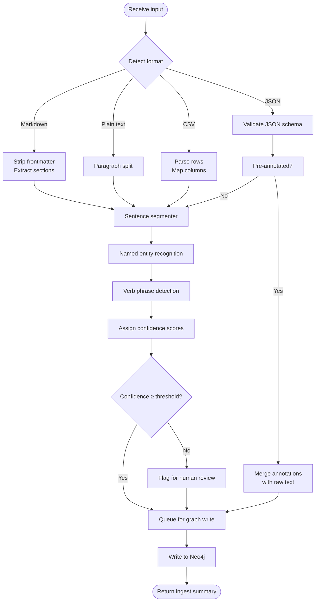

**Diagram 6 — Input Processing Activity Diagram.** This diagram traces input through all pre-processing stages before graph persistence. Every format converges on the sentence segmenter and then proceeds through NER, verb phrase detection, and confidence scoring. Items below the confidence threshold are not discarded — they are flagged and queued with a review annotation so that human judgment can resolve ambiguity.

---

## 6. Graph Construction Pipeline

### 6.1 Construction Sequence

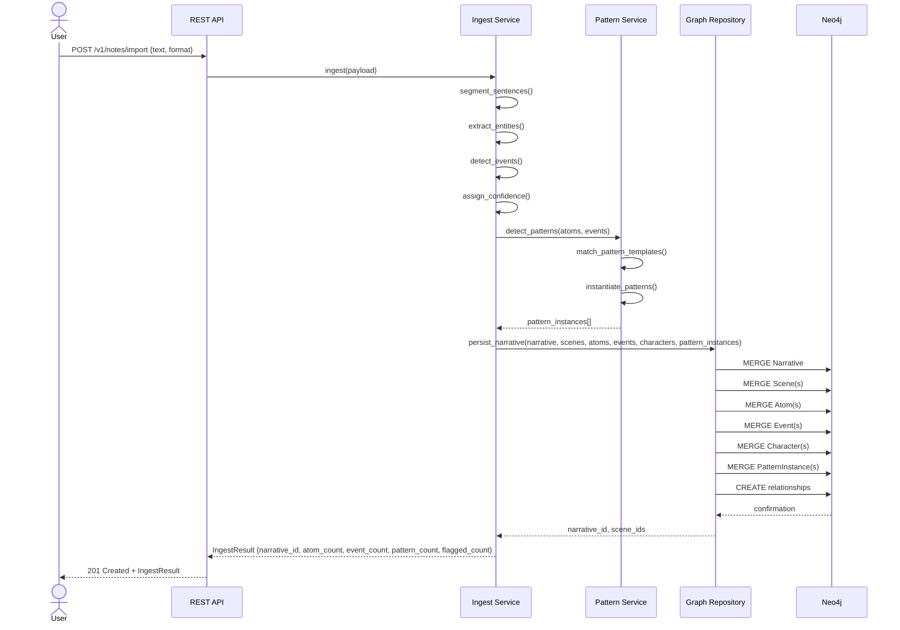

**Diagram 7 — Graph Construction Sequence.** This sequence diagram shows the full ingest pipeline. The Ingest Service owns all pre-processing; the Pattern Service detects and instantiates pattern templates before any graph writes occur; the Graph Repository translates the domain objects into idempotent Cypher `MERGE` operations. All writes are idempotent: re-ingesting the same source text does not duplicate nodes.

### 6.2 Pattern Detection

Pattern detection works against a library of **Pattern Templates** stored in the graph. Each template defines:

- A named slot structure (e.g., `giver`, `receiver`, `object`, `occasion`)
- A family tag (e.g., `ritual`, `conflict`, `threshold`, `revelation`)
- A matching heuristic: verb class, entity role combination, or user-supplied hint

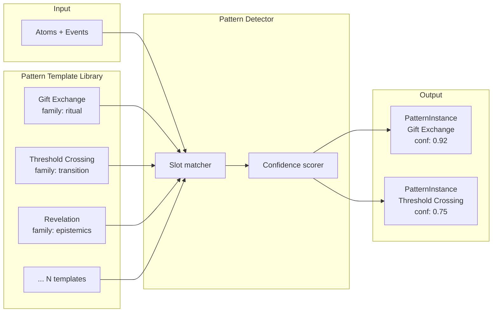

**Diagram 8 — Pattern Detection Flow.** Pattern detection is a matching operation between incoming atoms/events and the template library. Confidence scoring allows multiple patterns to co-exist on the same scene. Patterns with overlapping slots are not collapsed — they are represented as separate `PatternInstance` nodes so that a scene can simultaneously be a ritual exchange and a threshold crossing.

---

## 7. Transformation Engine

### 7.1 Transformation Axes

TNGS supports six defined transformation axes. Each axis operates on a bounded vocabulary and produces a new state node rather than overwriting the existing one.

| Axis | Operates on | State node produced | Key parameters |
|---|---|---|---|
| `pov` | Scene | `Perspective` | `focalizer` (Character id), `distance` (zero/internal/external), `reliability` (reliable/unreliable/ambiguous) |
| `mood` | Scene | `MoodState` | `label` (string), `valence` (−1.0..1.0), `arousal` (0.0..1.0) |
| `genre` | Scene or Narrative | `GenreProfile` | `name`, `conventions` (JSON array of constraint strings) |
| `chronotope` | Scene | `Chronotope` | `time_mode` (cyclical/linear/suspended/compressed), `space_mode` (bounded/open/liminal/utopian) |
| `reliability` | Perspective | Updated `Perspective` | `reliability` field change; may produce a new `Perspective` node linked to existing `Character` |
| `code_overlay` | Atom | `CodeTag` | `code` (Barthesian enumeration), `label` |

### 7.2 Transformation as a Non-Destructive Graph Rewrite

Every transformation:

1. Creates a new state node (`Perspective`, `MoodState`, etc.)
2. Detaches the old `CURRENT_*` relationship from the Scene
3. Attaches the new `CURRENT_*` relationship
4. Creates a `Transform` audit node linked to the Scene and to the new state node

The old state node remains in the graph. The transformation lineage is fully traversable.

### 7.3 Transformation Sequence (POV example)

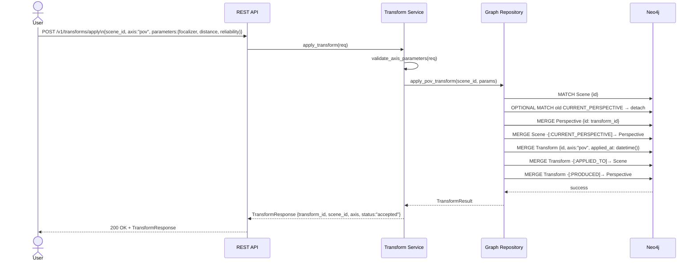

**Diagram 9 — POV Transformation Sequence.** The Transform Service validates parameters before any graph write. The Repository issues the Cypher in a single managed transaction: detach old perspective edge, merge new Perspective node, attach new edge, create Transform audit node with two outgoing relationships. On failure the transaction rolls back cleanly; no partial state is written.

### 7.4 Transformation State Machine

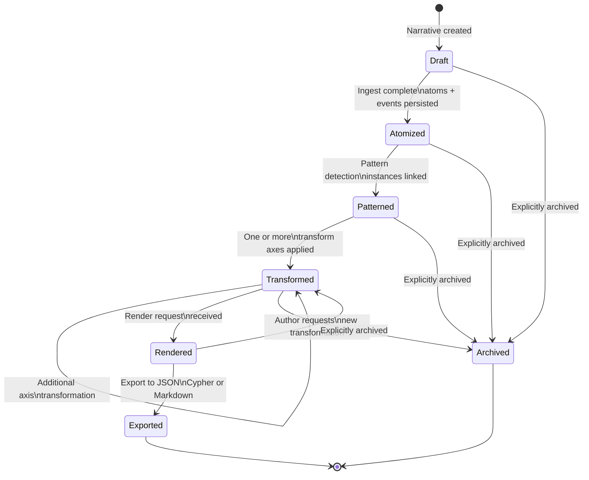

**Diagram 10 — Narrative State Machine.** A Narrative moves through well-defined states. State is stored as the `status` property on the `Narrative` node. Transitions are driven by API operations. The `Transformed → Transformed` self-loop reflects that multiple transformation axes can be applied iteratively. A Narrative can be archived from any active state.

### 7.5 Transformation Algebra Summary

The transformation axes form a partial algebra: some axes commute (applying mood then genre produces the same final state as genre then mood), while others do not (applying POV then reliability produces a different Perspective node than reliability then POV, because reliability is a property of the Perspective produced by the POV transform). The system does not enforce commutativity; it records the exact sequence in the Transform lineage, giving analysts the information needed to study order effects.

---

## 8. Output Specification

### 8.1 Render Output Types

| Output type | Trigger | Format | Description |
|---|---|---|---|
| Prose draft | `POST /v1/render/{id}?type=prose` | Markdown string | Atoms in surface order, decorated with current perspective, mood, and genre conventions |
| Transformation diff | `POST /v1/render/{id}?type=diff` | JSON object | Side-by-side old and new state for each transformed axis |
| Pattern summary | `GET /v1/narratives/{id}?include=patterns` | JSON array | All PatternInstances with confidence and scene references |
| Transformation history | `GET /v1/narratives/{id}?include=transforms` | JSON array | Ordered list of Transform nodes with axis, operator, timestamp, and produced state |
| JSON export | `POST /v1/render/{id}?type=json` | JSON document | Full graph state serialized as node/edge lists |
| Cypher export | `POST /v1/render/{id}?type=cypher` | Text/Cypher | Replayable Cypher script that recreates all persisted state |
| Markdown summary | `POST /v1/render/{id}?type=markdown` | Markdown document | Structured document with scene summaries, patterns, and transformation log |

### 8.2 Render Pipeline

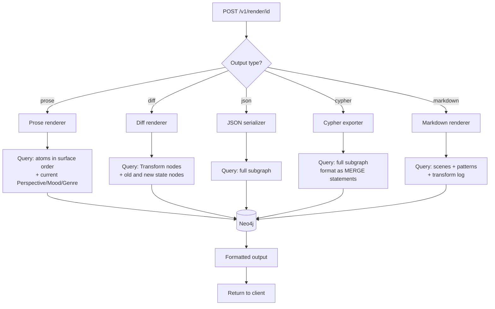

**Diagram 11 — Render Pipeline.** All renderers share the same pattern: receive a render request, issue a targeted Cypher query, format the result, and return it. The renderers are pluggable: the `RenderService` accepts registered renderer implementations, so new output types can be added without modifying core graph logic.

---

## 9. Functional Requirements

| ID | Requirement | Priority |
|---|---|---|
| FR-1 | The system shall ingest free-form notes in plain text, Markdown, and JSON payloads | Must |
| FR-2 | The system shall accept bulk corpus input via CSV for initial large-scale loads | Should |
| FR-3 | The system shall segment ingested text into candidate atoms using sentence-boundary detection | Must |
| FR-4 | The system shall extract named entities and assign them to Character nodes | Must |
| FR-5 | The system shall detect verb phrases and create Event nodes with tense and aspect properties | Must |
| FR-6 | The system shall assign a confidence score between 0.0 and 1.0 to every automatically derived node | Must |
| FR-7 | The system shall flag atoms, events, and entities below the confidence threshold for human review without discarding them | Must |
| FR-8 | The system shall store narratives, scenes, atoms, events, characters, patterns, and pattern instances in Neo4j | Must |
| FR-9 | The system shall represent recurring patterns as explicit Pattern template nodes and PatternInstance nodes | Must |
| FR-10 | The system shall detect pattern families from a registered template library during ingest | Should |
| FR-11 | The system shall allow users to register new Pattern templates via the API | Must |
| FR-12 | The system shall support at minimum six transformation axes: POV, mood, genre, chronotope, reliability, and code overlay | Must |
| FR-13 | The system shall preserve transformation lineage as auditable graph state using Transform nodes; it shall not destructively overwrite prior state nodes | Must |
| FR-14 | The system shall expose a REST API for ingest, narrative query, pattern query, transform, render, and health operations | Must |
| FR-15 | The system shall render graph states into prose drafts, transformation diffs, JSON exports, Cypher exports, and Markdown summaries | Must |
| FR-16 | The system shall support corpus-level queries for repeated pattern families, scene trajectories, and transformation histories | Should |
| FR-17 | The system shall expose operational liveness and readiness endpoints | Must |
| FR-18 | The system shall support administrative database dump and restore workflows | Must |
| FR-19 | The system shall allow export of any narrative to JSON, Cypher, or Markdown | Must |
| FR-20 | The system shall enforce uniqueness constraints on all primary node IDs via named Neo4j constraints | Must |
| FR-21 | The system shall version graph schema changes through reviewed migration scripts | Must |

---

## 10. External Interface Requirements

### 10.1 REST API Interface

**Protocol:** HTTP/1.1 and HTTP/2 over TLS in production  
**Authentication:** Bearer token (minimum); mTLS optional for service-to-service  
**Request/Response format:** JSON  
**Documentation:** OpenAPI 3.1 auto-generated by FastAPI at `/docs`

| Endpoint | Method | Request body | Response | Description |
|---|---|---|---|---|
| `/v1/notes/import` | POST | `IngestRequest` | `IngestResult` | Ingest and atomize notes |
| `/v1/narratives/{id}` | GET | — | `NarrativeSummary` | Retrieve narrative state |
| `/v1/narratives/{id}` | DELETE | — | `204` | Archive a narrative |
| `/v1/patterns` | POST | `PatternRequest` | `PatternRecord` | Register a pattern template |
| `/v1/patterns` | GET | query: `family` | `PatternList` | List all or filtered patterns |
| `/v1/patterns/{id}/instances` | GET | — | `InstanceList` | List concrete realizations |
| `/v1/transforms/apply` | POST | `TransformRequest` | `TransformResponse` | Apply an axis transformation |
| `/v1/transforms/{id}` | GET | — | `TransformRecord` | Retrieve transform audit record |
| `/v1/render/{id}` | POST | `RenderRequest` | `RenderResponse` | Render current graph state |
| `/v1/health/live` | GET | — | `200` | Liveness probe |
| `/v1/health/ready` | GET | — | `200 \| 503` | Readiness probe (checks Neo4j) |

### 10.2 Application-to-Database Interface

- **Driver:** Official Neo4j Python driver (`neo4j>=6.0`)
- **Protocol:** Bolt over port 7687
- **Database name:** Always specified explicitly in driver calls via `database_` parameter
- **Transaction pattern:** Managed transactions for writes; lazy result iteration for large reads; eager `execute_query()` only for small, bounded reads
- **Connection management:** Single driver instance per application process; driver manages its own connection pool

### 10.3 Bulk Ingest Interface

| Method | Tool | Use case |
|---|---|---|
| Transactional API | `POST /v1/notes/import` | Individual notes, real-time ingest |
| `LOAD CSV` | Cypher via API or admin | Medium structured corpora |
| `neo4j-admin database import` | Admin CLI (container exec) | Large initial corpus loads; requires offline database |

### 10.4 Rendering Interface Contract

The `RenderService` accepts implementations of the following protocol (Python):

```python
class RendererProtocol(Protocol):
    def render(self, graph_state: GraphState, params: dict) -> RenderOutput:
        ...
```

Renderers are registered at startup. No renderer may issue direct Cypher; all graph access must pass through the `GraphRepository`.

### 10.5 User Interface

There is no graphical user interface in the initial release. All user interaction occurs via the REST API, documented at `/docs`. The OpenAPI schema constitutes the normative user interface specification.

---

## 11. Non-Functional Requirements

### 11.1 Performance

| ID | Requirement |
|---|---|
| NFR-1 | The API shall return p95 read responses under 300 ms for indexed lookups on a warm dataset of typical working size (≤ 100,000 nodes) |
| NFR-2 | A single transformation operation on one scene-sized subgraph (≤ 500 nodes) shall complete under 2 seconds under normal load |
| NFR-3 | The system shall start successfully from `docker compose up` within 5 minutes on a standard development workstation |
| NFR-4 | Heap and page-cache sizes shall be set intentionally in configuration; default guesses are not acceptable for production deployment |

### 11.2 Reliability

| ID | Requirement |
|---|---|
| NFR-5 | The system shall tolerate invalid, malformed, or adversarial user input without corrupting graph integrity |
| NFR-6 | All write operations shall be atomic; no partial graph state shall persist after a failed transaction |
| NFR-7 | The system shall log all failed operations with sufficient context to diagnose the failure without re-running it |

### 11.3 Security

| ID | Requirement |
|---|---|
| NFR-8 | All externally reachable API traffic shall run over HTTPS in production |
| NFR-9 | Secrets shall not be embedded in source code, Dockerfiles, or committed Compose files; they shall be injected from secret files or platform secret stores |
| NFR-10 | Neo4j native authentication shall be enabled by default; the default credentials shall be changed before any network-reachable deployment |
| NFR-11 | Prometheus metrics endpoints shall not be exposed to the public internet |
| NFR-12 | `LOAD CSV` access shall be restricted or disabled for untrusted users |

### 11.4 Maintainability

| ID | Requirement |
|---|---|
| NFR-13 | All changes to the graph schema shall be applied through versioned, reviewed migration scripts |
| NFR-14 | The system shall maintain named Neo4j constraints and indexes; anonymous or implicit constraints are not acceptable |
| NFR-15 | Every persisted node shall carry provenance fields: source reference, operator identifier, and creation timestamp |
| NFR-16 | Annotation ambiguity shall be represented as a first-class data concern via confidence fields and review flags, not silently resolved |

### 11.5 Observability

| ID | Requirement |
|---|---|
| NFR-17 | Monitoring shall include application logs, container logs, Neo4j health check, and Neo4j Prometheus metrics |
| NFR-18 | Application loggers shall be named at module level following Python logging conventions |
| NFR-19 | Alerting shall be configured for: disk pressure, heap/pagecache utilization, failed authentication bursts, long-running queries, and backup failures |

### 11.6 Backup and Recovery

| ID | Requirement |
|---|---|
| NFR-20 | Backups shall be restorable in a repeatable documented drill with defined RTO and RPO targets |
| NFR-21 | Backup procedures shall be edition-aware: offline dump/load for Community; online backups for Enterprise |
| NFR-22 | Restore drills shall verify graph counts, constraint integrity, and sample traversals |

---

## 12. UML Descriptions

This section provides a natural-language interpretation of each diagram in the document, explaining what it shows and why the design choices were made.

### Diagram 1 — System Function Map (Mind Map)

The mind map shows the six top-level functional domains: Ingest, Atomize, Graph Store, Pattern, Transform, and Render. The separation between Atomize and Graph Store is intentional: all pre-processing occurs before any graph write, so the graph is never left in a partially-atomized state. The separation between Pattern and Transform reflects that pattern detection happens once at ingest, while transformations can be applied iteratively and repeatedly throughout the system's lifetime.

### Diagram 2 — Component Architecture (Flowchart)

The layered architecture enforces a strict dependency rule: the API depends on Domain Services, Domain Services depend on the Repository, and the Repository depends on Neo4j. Nothing in the outer layers ever issues raw Cypher directly. This boundary means the graph query layer can be optimized, replaced, or tested in isolation without touching API or domain logic.

### Diagram 3 — Deployment Topology (Flowchart)

The two-container Compose stack is the default production baseline. The `app` container never accesses Neo4j's HTTP port (7474) — only the Bolt port (7687). Prometheus metrics scraping is shown as optional and must be kept internal. The secret file injection pattern eliminates the most common credential-leak vector in containerized applications.

### Diagram 4 — Entity Relationship Diagram

The ER diagram exposes two structural decisions. First, `Transform` is a node, not just a label: it carries its own properties and has two outgoing relationships (`APPLIED_TO` and `PRODUCED`). This makes transformation lineage queryable as a first-class graph traversal rather than a log side-channel. Second, `PatternInstance` sits between `Pattern` and `Atom/Event`: it is not a direct edge but a reified intermediate node, so that confidence, slot assignment, and version can be properties on the instance without polluting the template or the atoms.

### Diagram 5 — Domain Class Diagram

The class diagram shows that all enumeration types are bounded at the type level. `TransformAxis`, `BarthesCode`, `FocalizationDistance`, `AtomKind`, and `ReliabilityLevel` are enumerations, not open strings. This ensures that the graph vocabulary is controlled and queryable by value, not by substring matching.

### Diagram 6 — Input Processing Activity Diagram

The branching at confidence threshold deserves particular attention. Items below threshold are not dropped — they proceed to the graph with a review flag. This reflects the scholarly observation that annotation quality depends on representation choices and that human label variation is real data, not noise to be filtered. The system must be able to represent "this atom was assigned with low confidence and has not been reviewed" as a distinct state.

### Diagram 7 — Graph Construction Sequence

The sequence diagram shows that Pattern detection occurs before graph writes: the Pattern Service runs its matching algorithm in memory against the atoms and events, and the Graph Repository receives a complete bundle (narrative, scenes, atoms, events, characters, instances) and writes it in one pass. This means the graph is never in a state where atoms exist without their pattern instances having been evaluated.

### Diagram 8 — Pattern Detection Flow

The pattern detector operates as a slot-matcher against a template library stored in the graph. The library is itself graph data: Pattern nodes can be queried, versioned, and extended without code changes. The confidence scorer allows multiple pattern instances to coexist on a single scene, reflecting the real literary situation where a single scene can simultaneously instantiate a gift exchange, a threshold crossing, and a revelation.

### Diagram 9 — POV Transformation Sequence

The sequence shows that the Transform Service validates parameters before any Neo4j write. The Cypher executed in a single managed transaction: OPTIONAL MATCH old edge (detach), MERGE new Perspective node, MERGE new CURRENT_PERSPECTIVE edge, MERGE Transform node, MERGE Transform outgoing edges. If any step fails, the transaction rolls back and no partial state is committed. The old Perspective node is not deleted — it remains in the graph as part of the transformation history.

### Diagram 10 — Narrative State Machine

The state machine makes explicit that a Narrative can only be exported after it has been rendered, and can only be rendered after at least one transformation (or directly from the Patterned state, producing a baseline render). The self-loop on Transformed reflects that multiple axes can be applied without returning to Patterned. Archiving is a terminal state from any active state, giving administrators a clean path to remove work-in-progress without deletion.

### Diagram 11 — Render Pipeline

The render pipeline shows that all five renderers are separate implementations of the same pattern: query, format, return. No renderer shares query logic with another. This prevents coupling between output formats. The `GraphRepository` is the single point of contact with Neo4j for all renderers; renderers never issue Cypher directly.

---

## 13. Security Requirements

### 13.1 Authentication and Authorization

- Neo4j native authentication must be enabled; the default `neo4j`/`neo4j` credential must be rotated before any networked deployment
- API endpoints must be protected by at minimum a bearer token; role-based access control is required for administrative endpoints (`/v1/admin/*`)
- Enterprise Edition adds Neo4j RBAC, lockout behavior, and password constraints; these must be configured when Enterprise is deployed

### 13.2 Secrets Management

- Neo4j credentials must be injected via `NEO4J_AUTH_FILE` pointing to a secrets-mounted file
- No secrets appear in `compose.yaml`, `.env` committed to source control, or Dockerfiles
- The `.env.example` file contains only placeholder values and is the only `.env`-pattern file committed

### 13.3 Network Security

- Prometheus metrics endpoint (`2004`) must not be exposed beyond the Compose internal network or a properly secured reverse proxy
- Neo4j HTTP port (7474) must not be exposed to the public internet in production
- Bolt connections must use TLS in production; `dbms.connector.bolt.tls_level=REQUIRED` must be set

### 13.4 Input Validation

- All API request bodies must be validated against Pydantic models before any service call
- Cypher parameters must always be passed as driver parameters, never interpolated into query strings
- `LOAD CSV` access must be restricted to the admin user or disabled entirely for untrusted users

---

## 14. Testing Requirements

### 14.1 Test Layers

| Layer | Scope | Tool |
|---|---|---|
| Unit tests | Atomization, pattern matching, transformation logic, rendering | pytest |
| Repository tests | Cypher correctness against a disposable Neo4j test instance | pytest + testcontainers |
| API tests | All endpoints, request validation, error responses | FastAPI TestClient + httpx |
| Graph integrity tests | Constraints, required relationships, forbidden states | pytest + Cypher assertions |
| Performance regression tests | Representative Cypher queries against a warm dataset | pytest + timing assertions |
| Backup and restore drills | Full dump, restore to isolated volume, graph count verification | Shell script + scheduled CI job |

### 14.2 Test Coverage Requirements

- All transformation axis implementations must have unit test coverage
- All Cypher queries used in production paths must have repository test coverage
- All API endpoints must have at least one success-path and one error-path test
- Performance regression tests must run in CI on every merge to main

### 14.3 Dependency Override Testing

FastAPI dependency overrides must be used to isolate the database dependency in API tests. No API test may require a live Neo4j instance unless it is explicitly tagged as an integration test.

---

## 15. Operational Requirements

### 15.1 Containerized Operations

The system must be runnable from a single `docker compose up` command. The Compose file must:

- Pin image tags (no `latest`)
- Use `depends_on` with `condition: service_healthy` so the application waits for Neo4j to pass its health check before accepting traffic
- Mount Neo4j data, logs, and conf to named volumes on the host
- Inject credentials via secret file, not environment variables

### 15.2 Cold Start Verification Runbook

1. `docker compose up -d --build`
2. `docker compose ps` — confirm both services are running
3. Verify Neo4j health check passes: `docker compose exec neo4j wget -q -O- http://localhost:7474`
4. Hit `/v1/health/ready` — expect `200`
5. Run smoke Cypher: `MATCH (n) RETURN count(n)` — expect 0 or seeded count

### 15.3 Connection Failure Runbook

1. Check Compose network: `docker compose exec app env | grep NEO4J`
2. Verify Bolt URI is `bolt://neo4j:7687` (service name, not `localhost`)
3. Verify secret file is mounted and contains correct credentials
4. Verify `database_` parameter is explicit in all driver calls
5. Inspect Neo4j logs: `docker compose logs neo4j --tail 100`

### 15.4 Slow Query Runbook

1. Reproduce query; prefix with `EXPLAIN` to inspect the logical plan
2. Add `PROFILE` in a controlled tuning session (not on production under load)
3. Check for missing constraint or index on the filtered property
4. If result set is large, verify that the read path uses lazy iteration, not `execute_query()`
5. Retune heap and page cache if working-set analysis justifies it

### 15.5 Backup and Restore Runbook

**Backup (Community Edition — offline dump):**

```bash
# Stop write traffic first
docker compose stop app

docker run --interactive --tty --rm \
  --volume=$PWD/ops/neo4j/data:/data \
  --volume=$PWD/backups:/backups \
  neo4j/neo4j-admin:2026.04.0 \
  neo4j-admin database dump neo4j --to-path=/backups

docker compose start app
```

**Restore drill:**

```bash
docker run --interactive --tty --rm \
  --volume=$PWD/restore-data:/data \
  --volume=$PWD/backups:/backups \
  neo4j/neo4j-admin:2026.04.0 \
  neo4j-admin database load neo4j --from-path=/backups

# Verify restore
docker compose exec neo4j cypher-shell -u neo4j -p $PASSWORD \
  "MATCH (n) RETURN labels(n), count(n) ORDER BY count(n) DESC"
```

> **Note:** Dump files do not include users and roles metadata. User/role recreation must be scripted separately.

### 15.6 Schema Migration Runbook

1. Write migration Cypher to `ops/migrations/NNNN_description.cypher`
2. Review in pull request; migration must be idempotent (`IF NOT EXISTS`, `MERGE`)
3. Apply in staging: `docker compose exec neo4j cypher-shell < ops/migrations/NNNN_description.cypher`
4. Verify constraints: `SHOW CONSTRAINTS`
5. Apply in production; document elapsed time

### 15.7 CI/CD Pipeline

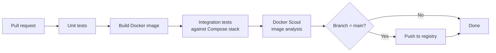

**Diagram 12 — CI/CD Pipeline.** Tests run before the image is built; integration tests run against the full Compose stack (not mocks); Docker Scout image analysis runs before push to catch vulnerabilities in the built image. Push to registry occurs only on merge to main after all prior stages pass.

---

## 16. Constraints and Limitations

### 16.1 Graph Structure Does Not Solve Prose Style

The graph controls structure, causality, focalization, and transformation lineage. It cannot, on its own, guarantee stylistic force. The rendering layer is an open design problem. The initial release ships with template-based renderers; LLM-assisted rendering is a pluggable extension, not a core dependency.

### 16.2 Pattern Boundary

The system uses explicitly modeled Pattern templates rather than automated subgraph isomorphism mining. This makes patterns queryable, explainable, versionable, and teachable. If large literary corpora require automated pattern discovery, a mining layer can be added as a future extension without modifying the core schema.

### 16.3 Annotation Ambiguity

Human annotation variation is real. Confidence fields and review flags represent ambiguity explicitly rather than forcing false certainty. Any evaluation of annotation quality must account for inter-annotator agreement and must treat annotation guidelines as a first-class artifact.

### 16.4 Edition Constraints

Several features described in this SRS require Neo4j Enterprise Edition:

- Online backup from a running server
- Causal clustering and read replicas
- Role-based access control (RBAC)
- Password constraints and account lockout

The baseline Community Edition supports: offline dump/load backup, standalone deployment, native auth, and the full Cypher feature set used by this system.

### 16.5 Commutativity of Transformations

Transformation axes do not commute in general. Applying POV then reliability produces a different Perspective node than reliability then POV. The Transform lineage records the exact sequence; the system makes no attempt to normalize or enforce commutativity. Analysts studying order effects should use the lineage graph directly.

---

## 17. Appendix: Cypher Schema Reference

```cypher
// ── Constraints ────────────────────────────────────────────────────────────
CREATE CONSTRAINT narrative_id IF NOT EXISTS
FOR (n:Narrative) REQUIRE n.id IS UNIQUE;

CREATE CONSTRAINT scene_id IF NOT EXISTS
FOR (s:Scene) REQUIRE s.id IS UNIQUE;

CREATE CONSTRAINT atom_id IF NOT EXISTS
FOR (a:Atom) REQUIRE a.id IS UNIQUE;

CREATE CONSTRAINT event_id IF NOT EXISTS
FOR (e:Event) REQUIRE e.id IS UNIQUE;

CREATE CONSTRAINT character_id IF NOT EXISTS
FOR (c:Character) REQUIRE c.id IS UNIQUE;

CREATE CONSTRAINT pattern_id IF NOT EXISTS
FOR (p:Pattern) REQUIRE p.id IS UNIQUE;

CREATE CONSTRAINT pattern_instance_id IF NOT EXISTS
FOR (pi:PatternInstance) REQUIRE pi.id IS UNIQUE;

CREATE CONSTRAINT perspective_id IF NOT EXISTS
FOR (pv:Perspective) REQUIRE pv.id IS UNIQUE;

CREATE CONSTRAINT mood_state_id IF NOT EXISTS
FOR (m:MoodState) REQUIRE m.id IS UNIQUE;

CREATE CONSTRAINT genre_profile_id IF NOT EXISTS
FOR (g:GenreProfile) REQUIRE g.id IS UNIQUE;

CREATE CONSTRAINT chronotope_id IF NOT EXISTS
FOR (ch:Chronotope) REQUIRE ch.id IS UNIQUE;

CREATE CONSTRAINT code_tag_id IF NOT EXISTS
FOR (ct:CodeTag) REQUIRE ct.id IS UNIQUE;

CREATE CONSTRAINT transform_id IF NOT EXISTS
FOR (t:Transform) REQUIRE t.id IS UNIQUE;

// ── Indexes ─────────────────────────────────────────────────────────────────
CREATE INDEX scene_sequence IF NOT EXISTS
FOR (s:Scene) ON (s.sequence);

CREATE INDEX atom_kind IF NOT EXISTS
FOR (a:Atom) ON (a.kind);

CREATE INDEX pattern_family IF NOT EXISTS
FOR (p:Pattern) ON (p.family);

CREATE INDEX transform_axis IF NOT EXISTS
FOR (t:Transform) ON (t.axis);

CREATE INDEX transform_applied_at IF NOT EXISTS
FOR (t:Transform) ON (t.applied_at);

// ── Seed: Narrative + Scene + Pattern ──────────────────────────────────────
MERGE (n:Narrative {id: $narrative_id})
SET n.title      = $title,
    n.status     = "draft",
    n.source_ref = $source_ref,
    n.created_at = datetime();

MERGE (s:Scene {id: $scene_id})
SET s.sequence = 1,
    s.summary  = $summary;

MERGE (n)-[:HAS_SCENE]->(s);

MERGE (p:Pattern {id: "pattern.gift_exchange"})
SET p.name        = "Gift Exchange",
    p.family      = "ritual",
    p.description = "A subject gives an object to another party under socially coded conditions";

MERGE (pi:PatternInstance {id: $instance_id})
SET pi.slot       = "scene-core",
    pi.confidence = 0.92;

MERGE (s)-[:CONTAINS]->(pi);
MERGE (pi)-[:INSTANCE_OF]->(p);

// ── Query: all instances of a pattern family ───────────────────────────────
MATCH (pi:PatternInstance)-[:INSTANCE_OF]->(p:Pattern {family: "ritual"})
MATCH (sc:Scene)-[:CONTAINS]->(pi)
RETURN sc.id AS scene_id, p.name AS pattern_name, pi.confidence
ORDER BY pi.confidence DESC;

// ── Transform: apply POV without destroying history ───────────────────────
MATCH (s:Scene {id: $scene_id})
OPTIONAL MATCH (s)-[old:CURRENT_PERSPECTIVE]->(:Perspective)
DELETE old
WITH s
MERGE (pov:Perspective {id: $perspective_id})
SET pov.focalizer   = $focalizer_id,
    pov.distance    = $distance,
    pov.reliability = $reliability
MERGE (s)-[:CURRENT_PERSPECTIVE]->(pov)
WITH s, pov
MERGE (t:Transform {id: $transform_id})
SET t.axis       = "pov",
    t.operator   = $operator,
    t.applied_at = datetime(),
    t.parameters = $parameters
MERGE (t)-[:APPLIED_TO]->(s)
MERGE (t)-[:PRODUCED]->(pov);

// ── Query: full transformation lineage for a scene ─────────────────────────
MATCH (t:Transform)-[:APPLIED_TO]->(s:Scene {id: $scene_id})
OPTIONAL MATCH (t)-[:PRODUCED]->(produced)
RETURN t.axis, t.operator, t.applied_at, labels(produced) AS produced_type, produced.id
ORDER BY t.applied_at ASC;

// ── Query: atoms in surface order with current mood and perspective ─────────
MATCH (n:Narrative {id: $narrative_id})-[:HAS_SCENE]->(s:Scene)
MATCH (s)-[:CONTAINS]->(a:Atom)
OPTIONAL MATCH (s)-[:CURRENT_PERSPECTIVE]->(pov:Perspective)
OPTIONAL MATCH (s)-[:CURRENT_MOOD]->(mood:MoodState)
RETURN s.sequence, a.surface_order, a.text, pov.focalizer, pov.distance, mood.label
ORDER BY s.sequence, a.surface_order;
```

---

*End of Software Requirements Specification — Transformable Narrative Graph System v1.0*
