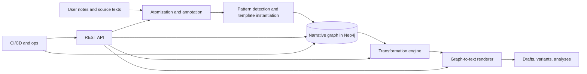
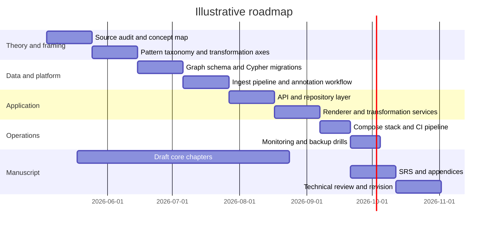

# White Paper and Book Treatment for a Transformable Narrative Graph System

## Executive summary

Your notes point toward a genuinely original book: a hybrid of literary theory, design methodology, graph data modeling, and implementation manual. The core claim is that narrative can be decomposed into small expressive units, assembled into recurring patterns, stored as an explicit graph, and then transformed along axes such as point of view, mood, genre, chronotope, reliability, and archetypal mode. The closest published work sits nearby rather than directly on top of this idea: computational narratology links literary theory to computation, recent story-generation work uses editable knowledge graphs to improve user control, narrative-centric KG research proposes practical construction methods, and pattern-language/ontology work shows how recurring solutions can be formalized as connected structures. This literature scan did not surface a canonical monograph that already unifies these exact ingredients. That gap is the book’s opening. citeturn14view4turn14view1turn14view2turn15view0turn21view0turn15view3turn15view4

The strongest technical recommendation is a provider-neutral, end-to-end system built around Python, a containerized entity["company","Neo4j","graph database company"] deployment, and entity["company","Docker","container software company"] Compose as the default development and small-team operating model. That baseline is the least assumption-heavy choice because the brief specifies no budget, no hosting provider, and no fixed scale. It also aligns with official guidance on Compose, Neo4j Docker deployment, Neo4j’s Python driver, and operational concerns such as configuration, monitoring, backup/restore, and security. If the project later needs clustering, failover, and online backups, the design can evolve toward Neo4j Enterprise without rewriting the application model. citeturn16view9turn17view0turn18view0turn18view1turn23view0turn13view9turn26view0turn18view7

The report therefore recommends that the white paper and the book treatment present the project as both an intellectual intervention and a buildable system. Structurally, the book should do four jobs at once: establish the theory, define the graph model, demonstrate transformation mechanics, and document the software as if it were an implementable reference architecture. The SRS should not be a generic appendix; it should be a core deliverable that proves the concept is operationally real rather than merely metaphorical. At the same time, the book should avoid pretending that graph structure alone is “the story.” Recent work on plot extraction and narrative visualization is a useful warning here: graphs can clarify events, relations, and causal structure, but stylistic realization and full plot semantics still require an additional rendering layer and careful annotation discipline. citeturn13view20turn14view3turn33view0

## Research basis and scope

The conceptual spine of the project is the fusion of the atomized, repetitive, present-oriented prose associated with entity["people","Gertrude Stein","american writer"] and the generative, reusable pattern-language method associated with entity["people","Christopher Alexander","architect theorist"]. In your notes, Stein’s “atoms” function as the smallest meaningful literary units, while Alexander’s patterns function as recurrent, higher-order arrangements. The graph then becomes the bridge between them: atoms become nodes, patterns become repeated subgraphs or template structures, and transformations become graph rewrites, reweightings, retaggings, or reinterpretations.

The project becomes richer because your notes do not stop at POV, mood, and genre. They extend the transformation vocabulary through entity["people","Mikhail Bakhtin","literary theorist"], entity["people","Wayne C. Booth","literary critic"], entity["people","William H. Gass","american novelist"], entity["people","David Lodge","english novelist"], entity["people","John Gardner","novelist teacher"], entity["people","Northrop Frye","literary critic"], and entity["people","Roland Barthes","literary theorist"]. That is not a decorative reading list. It gives the graph a real transformation algebra: heteroglossia, chronotope, narrative distance, reliability, sonic/rhythmic emphasis, intertextual overlay, fictional dream/detail density, mythic mode, seasonal plot architecture, and Barthesian code tagging. The result is not just “story in a graph,” but a graph whose nodes and subgraphs can carry literary-critical semantics.

That makes the right audience fairly specific. Based on your notes, the primary readers are digital-humanities practitioners who are comfortable with literary criticism, graph thinking, and hands-on implementation. Secondary readers are computational narratologists, experimental writers, knowledge-graph engineers, narratologists, and design-methodology readers. The book should not be written for novices. It should assume conceptual literacy, but it should still show every major abstraction twice: once in critical/theoretical language, and once in data-model or implementation language.

The practical scope in this report is intentionally end to end. The system starts from free-form notes, extracts atoms and patterns, stores them in a graph, supports explicit transformations, renders graph states back into prose or structured analytic outputs, and includes a full operational specification for packaging, deployment, security, testing, monitoring, backup/restore, and day-two operations. Neo4j’s own documentation supports this kind of full-stack treatment because it covers data modeling, import strategies, constraints and indexes, driver patterns, performance tuning, Docker deployment, security, monitoring, and backup/restore in one stack. citeturn16view8turn31view0turn31view1turn24view1turn24view0turn23view0turn23view2turn17view0turn16view6turn18view6turn18view7

The strongest scholarly framing for the project is to present it as a missing synthesis. Computational narratology literature argues that theory should inform computational narrative work, while newer KG-based storytelling work shows that editable graphs can improve user agency in generation. Narrative-centric KG work proposes concrete methods for turning narratives into graphs, and event-centric graph-to-text research shows the value of representing causal, enabling, and preventive relations rather than merely who/what/when/where. Pattern-language and ontology-formalization work then fills in the missing middle: how recurring design solutions become structured, queryable, evolving languages rather than isolated motifs. citeturn14view4turn14view1turn15view0turn21view0turn15view3turn15view4

## Outline and synopsis

### Outline

A workable outline for the book is this:

1. **The problem the book solves**  
   Why narrative graphs are usually too technical for literary readers and too theoretically thin for literary theory.

2. **Atoms, lexias, and minimal units**  
   Steinian decomposition, Barthesian segmentation, and what counts as an atomic narrative unit.

3. **Patterns as recurring literary machinery**  
   Alexander’s method translated into narrative design and graph templates, with entity["book","A Pattern Language","1977 design book"] as the conceptual hinge.

4. **From pattern language to graph language**  
   How atoms, edges, subgraphs, and pattern instances become a reusable graph grammar.

5. **Narrative transformation axes**  
   POV, mood, genre, chronotope, reliability, intertextual overlay, fictional mode, and code recoding.

6. **The narrative graph data model**  
   Labels, relationships, constraints, versioning, provenance, and graph schema.

7. **Python implementation**  
   Package architecture, APIs, repositories, transformation services, graph-to-text adapters.

8. **Neo4j implementation**  
   Cypher, import paths, constraints, indexes, query patterns, profiling, performance.

9. **Containerized operations**  
   Dockerfiles, Compose, secrets, TLS, CI/CD, monitoring, backup/restore, runbooks.

10. **Case study**  
    A single running example transformed repeatedly across the book.

11. **Evaluation**  
    Structural validity, annotation quality, narrative-control metrics, failure modes.

12. **Limits and future work**  
    What graphs can formalize, what they cannot, and where human interpretation remains irreducible.

### Synopsis

This book argues that narrative can be treated as a transformable graph language rather than a fixed linear artifact. It begins from the proposition that literary expression can be broken into small, reusable units without sacrificing complexity, then shows how those units can be assembled into recurring narrative patterns. Once made explicit in graph form, those patterns can be queried, compared, reused, versioned, and transformed.

The book’s central innovation is to combine a literary account of atomic writing with a design-method account of pattern languages and then operationalize both in software. The graph becomes a controlled space where literary-critical categories are not merely discussed but encoded. Point of view can be shifted by changing focalization structures. Mood can be altered by retagging sensory or affective attributes. Genre can be changed by swapping pattern sets while preserving core entities and event relations. Chronotope, reliability, intertextuality, and mythic mode become concrete transformation operators.

The final promise of the book is practical. It does not stop with a theory of transformable narrative. It provides the architecture, graph schema, Cypher, Python modules, Docker packaging, and operational specification necessary to implement the idea as a real system.

## Book treatment

This should be written as a serious crossover book: part scholarly argument, part design manual, part systems handbook. The voice should be controlled, exact, and unsentimental. No startup vapor, no inflated claims about “reinventing storytelling,” and no treating the graph as magic. The tone should say: here is the problem, here is the formalism, here is the implementation, here is where it breaks.

The strongest formal device for the book is a recurring chapter pattern. Each major chapter should move through the same sequence:

- a literary problem
- the relevant theoretical vocabulary
- the graph formalization
- the implementation move
- the transformation example
- the operational or interpretive failure modes

That structure is not arbitrary. Pattern-language writing itself benefits from a summary that gives readers the big picture and from a running example that shows how patterns work together rather than as isolated fragments. That same advice applies here: the book should introduce the language as a whole early, and it should carry one durable example from chapter to chapter so readers can see how theory, graph structure, and code stay aligned. citeturn15view5

A strong writing treatment would look like this:

### Narrative stance

The authorial stance should be that of a builder-critic. The book should sound like someone equally at home reading narratology and shipping software. It should not imitate Stein stylistically at full scale; that would turn the book into an exercise rather than an argument. Instead, borrow only the discipline of repetition: key terms recur with slight variation until the reader feels the structure.

### Chapter texture

Each chapter should contain three repeating textual layers:

- **Theory layer**: concise expository prose on the literary model.
- **Structure layer**: a graph view, schema, pattern card, or transformation rule.
- **Implementation layer**: code, query, test, operational consequence.

That repetition produces coherence. It also makes the book useful in more than one reading mode. A critic can read the theory straight through. An engineer can skim for schemas, APIs, and runbooks. A hybrid reader can traverse all three.

### Style rules

Use short declarative paragraphs for definitions. Use denser paragraphs only when comparing theorists or explaining trade-offs. Put all abstractions under pressure with examples. Avoid metaphors that blur the engineering. If something is a node, call it a node. If it is only analogous to a node, say so.

### Running example

Use a single compact narrative pattern throughout the book. The “gift exchange” pattern in your notes is a good seed because it can survive multiple transformations without collapsing: it can be retold from another focalizer, shifted into another mood, overlaid with another genre, or placed in a different chronotope. That lets the book demonstrate continuity across theory and implementation.

### Market positioning

Position the manuscript as the first full treatment of transformable narrative graphs for digital-humanities readers who also build systems. The clearest competitive advantage is not that it covers any one topic better than the nearest specialist book. It is that it connects literary-critical theory, graph form, and deployable software in one argument.

## System architecture and implementation blueprint

The technical design should separate four concerns: structural extraction, graph storage, transformation logic, and textual realization. That separation matters because current narrative-graph research is strong on structure but does not justify collapsing structure and style into one mechanism. Recent work on plot extraction explicitly warns that simple structural visualizations do not fully capture plot, while KG-driven storytelling work shows that editable graphs improve user control rather than automatically solving narrative quality in the large. citeturn14view3turn14view1



### Architecture alternatives

| Alternative | Core idea | Best use | Main upside | Main downside |
|---|---|---|---|---|
| Notebook-first prototype | Jupyter plus local Neo4j | theory exploration, schema sketching | fastest early learning | weak repeatability and poor ops |
| Modular monolith | One Python API plus domain services plus one Neo4j instance | small team, first production release | lowest complexity with clean boundaries | fewer scaling levers |
| Modular monolith with worker queue | API plus background jobs for large imports and renders | medium workloads and batch transforms | better throughput and responsiveness | more operational surface |
| Distributed services with Neo4j cluster | separate ingest, transform, render services plus clustered graph DB | HA, larger teams, heavier read traffic | stronger resilience and scale | highest cost and highest operational burden |

Because the brief does not define provider, budget, or scale, the modular monolith is the right default. Compose is the latest recommended format for multi-service applications, Compose networks provide service discovery by service name, and health-gated startup can be handled with `depends_on` plus healthchecks. Neo4j clustering in containers is possible, but clustering, failover, and the broader online-backup story sit in Enterprise Edition. citeturn16view9turn22view0turn16view10turn13view9turn26view0turn18view7

### Recommended baseline

The recommended first release is:

- FastAPI-based Python application
- Neo4j standalone server in Docker Compose
- explicit graph repository layer using the official Neo4j Python driver
- optional background worker for heavy ingestion or rendering
- CI pipeline that runs tests, builds images, and validates container behavior before push
- monitoring via container logs plus Neo4j metrics
- offline dump/load backup in Community Edition, with a migration path to online backups in Enterprise

This is the most defensible baseline because it keeps all design choices reversible.

### Data model and graph schema

The graph model should treat patterns as first-class objects rather than trying to rediscover arbitrary subgraph isomorphisms for every operation. That follows directly from pattern-language and ontology work: a language becomes useful when the patterns are connected, named, queryable, and capable of evolving as a system rather than remaining isolated fragments. It also fits current narrative-KG work, which emphasizes structured event relations and explicit graph construction pipelines. citeturn15view4turn15view5turn15view0turn21view0

A practical schema is:

| Label | Key properties | Purpose |
|---|---|---|
| `Narrative` | `id`, `title`, `status`, `source_ref` | top-level work or draft |
| `Scene` | `id`, `sequence`, `summary` | bounded narrative segment |
| `Atom` | `id`, `text`, `kind`, `surface_order` | minimal expressive unit |
| `Event` | `id`, `verb`, `tense`, `aspect` | action-bearing unit |
| `Character` | `id`, `name`, `role` | participants and focalizers |
| `Pattern` | `id`, `name`, `family`, `description` | reusable template |
| `PatternInstance` | `id`, `slot`, `confidence` | concrete realization of a pattern |
| `Perspective` | `id`, `focalizer`, `distance`, `reliability` | POV state |
| `MoodState` | `id`, `label`, `valence`, `arousal` | affective state |
| `GenreProfile` | `id`, `name`, `conventions` | genre encoding |
| `Chronotope` | `id`, `time_mode`, `space_mode` | Bakhtinian time-space frame |
| `CodeTag` | `id`, `code`, `label` | Barthesian code attachment |
| `Transform` | `id`, `axis`, `applied_at`, `operator` | change event and lineage |

Core relationships:

- `(:Narrative)-[:HAS_SCENE]->(:Scene)`
- `(:Scene)-[:CONTAINS]->(:Atom|:Event|:PatternInstance)`
- `(:PatternInstance)-[:INSTANCE_OF]->(:Pattern)`
- `(:PatternInstance)-[:REALIZES]->(:Atom|:Event)`
- `(:Character)-[:PARTICIPATES_IN]->(:Event)`
- `(:Event)-[:CAUSES|ENABLES|PREVENTS|PRECEDES]->(:Event)`
- `(:Scene)-[:CURRENT_PERSPECTIVE]->(:Perspective)`
- `(:Scene)-[:CURRENT_MOOD]->(:MoodState)`
- `(:Scene)-[:CURRENT_GENRE]->(:GenreProfile)`
- `(:Scene)-[:IN_CHRONOTOPE]->(:Chronotope)`
- `(:Atom)-[:TAGGED_AS]->(:CodeTag)`
- `(:Transform)-[:APPLIED_TO]->(:Scene|:Narrative)`
- `(:Transform)-[:PRODUCED]->(:Perspective|:MoodState|:GenreProfile|:PatternInstance)`

This model is opinionated in one important way: it preserves transformation lineage. Do not overwrite mood, genre, or focalization in place unless the system is explicitly disposable. A book treatment tied to a software platform should prefer auditable versions.

### Cypher schema and query examples

```cypher
// Constraints
CREATE CONSTRAINT narrative_id IF NOT EXISTS
FOR (n:Narrative) REQUIRE n.id IS UNIQUE;

CREATE CONSTRAINT scene_id IF NOT EXISTS
FOR (s:Scene) REQUIRE s.id IS UNIQUE;

CREATE CONSTRAINT atom_id IF NOT EXISTS
FOR (a:Atom) REQUIRE a.id IS UNIQUE;

CREATE CONSTRAINT event_id IF NOT EXISTS
FOR (e:Event) REQUIRE e.id IS UNIQUE;

CREATE CONSTRAINT pattern_id IF NOT EXISTS
FOR (p:Pattern) REQUIRE p.id IS UNIQUE;

CREATE CONSTRAINT pattern_instance_id IF NOT EXISTS
FOR (pi:PatternInstance) REQUIRE pi.id IS UNIQUE;

CREATE INDEX scene_sequence IF NOT EXISTS
FOR (s:Scene) ON (s.sequence);

// Seed a narrative, a scene, and a reusable pattern
MERGE (n:Narrative {id: $narrative_id})
SET n.title = $title, n.status = "draft"

MERGE (s:Scene {id: $scene_id})
SET s.sequence = 1, s.summary = "Gift exchange"

MERGE (n)-[:HAS_SCENE]->(s)

MERGE (p:Pattern {id: "pattern.gift_exchange"})
SET p.name = "Gift Exchange",
    p.family = "ritual",
    p.description = "A subject gives an object to another party"

MERGE (pi:PatternInstance {id: $pattern_instance_id})
SET pi.slot = "scene-core", pi.confidence = 0.92

MERGE (s)-[:CONTAINS]->(pi)
MERGE (pi)-[:INSTANCE_OF]->(p);

// Retrieve all instances of a pattern family
MATCH (pi:PatternInstance)-[:INSTANCE_OF]->(p:Pattern {family: "ritual"})
MATCH (scene:Scene)-[:CONTAINS]->(pi)
RETURN scene.id AS scene_id, p.name AS pattern_name, pi.confidence
ORDER BY scene.id;

// Apply a POV transformation without destroying history
MATCH (s:Scene {id: $scene_id})
OPTIONAL MATCH (s)-[old:CURRENT_PERSPECTIVE]->(:Perspective)
DELETE old
WITH s
MERGE (pov:Perspective {id: $transform_id})
SET pov.focalizer = $character_id,
    pov.distance = $distance,
    pov.reliability = $reliability
MERGE (s)-[:CURRENT_PERSPECTIVE]->(pov)
MERGE (t:Transform {id: $transform_id})
SET t.axis = "pov", t.operator = $operator, t.applied_at = datetime()
MERGE (t)-[:APPLIED_TO]->(s)
MERGE (t)-[:PRODUCED]->(pov);
```

These examples rely on official Neo4j mechanisms for constraints, indexing, query execution, and profiling. Constraints should be named and created explicitly; indexes are used automatically by the planner; `EXPLAIN` and `PROFILE` should be part of normal query tuning; and heavy queries should be profiled deliberately rather than casually. citeturn24view1turn24view0turn24view2

### Import strategy

For small and medium note sets, the system should support transactional ingest through the API and optional CSV imports via `LOAD CSV`. For initial corpus-scale loads, the better path is `neo4j-admin database import`, which writes native store files and is intended for large initial imports or large incremental loads when administrative access is available. citeturn31view0turn31view1

### Python package structure

```text
project/
  pyproject.toml
  compose.yaml
  .env.example
  secrets/
    neo4j_auth.txt
  src/
    narrative_graph/
      api/
        main.py
        routes/
          narratives.py
          patterns.py
          transforms.py
          health.py
      config/
        settings.py
      domain/
        models.py
        enums.py
      repositories/
        graph_repository.py
      services/
        ingest_service.py
        pattern_service.py
        transform_service.py
        render_service.py
      infrastructure/
        neo4j_client.py
        logging_config.py
      schemas/
        requests.py
        responses.py
  tests/
    unit/
    integration/
  ops/
    neo4j/
      neo4j.conf
    ci/
      github-actions.yml
```

```toml
# pyproject.toml
[build-system]
requires = ["hatchling"]
build-backend = "hatchling.build"

[project]
name = "narrative-graph"
version = "0.1.0"
description = "Transformable narrative graph system"
requires-python = ">=3.12"
dependencies = [
  "fastapi>=0.115",
  "uvicorn[standard]>=0.30",
  "neo4j>=6.0",
  "pydantic>=2.8"
]

[project.optional-dependencies]
dev = [
  "pytest>=8.0",
  "httpx>=0.27",
  "ruff>=0.6"
]
```

Using `pyproject.toml` as the project entry point is aligned with current Python packaging guidance, where the `[build-system]` table is strongly recommended, and isolated virtual environments remain the right default for development workflows. citeturn16view14turn13view16

### API and module design

A clean API should expose only stable domain actions, not raw Cypher. Recommended endpoints:

| Endpoint | Method | Purpose |
|---|---|---|
| `/v1/notes/import` | POST | ingest note text or structured note payload |
| `/v1/narratives/{id}` | GET | retrieve narrative summary and state |
| `/v1/patterns` | POST | define or register pattern templates |
| `/v1/patterns/{id}/instances` | GET | list concrete realizations |
| `/v1/transforms/apply` | POST | apply POV, mood, genre, chronotope, reliability, or code transformations |
| `/v1/render/{id}` | POST | render current graph state to prose or analytic output |
| `/v1/health/live` | GET | liveness probe |
| `/v1/health/ready` | GET | readiness probe |

```python
from typing import Any, Literal

from fastapi import Depends, FastAPI
from pydantic import BaseModel, Field
from neo4j import GraphDatabase

app = FastAPI()


class TransformRequest(BaseModel):
    scene_id: str
    axis: Literal["pov", "mood", "genre", "chronotope", "reliability"]
    parameters: dict[str, Any] = Field(default_factory=dict)


class TransformResponse(BaseModel):
    transform_id: str
    scene_id: str
    axis: str
    status: str


class GraphRepository:
    def __init__(self, uri: str, user: str, password: str, database: str) -> None:
        self._driver = GraphDatabase.driver(uri, auth=(user, password))
        self._database = database

    def apply_transform(self, req: TransformRequest, operator: str) -> TransformResponse:
        transform_id = f"{req.axis}:{req.scene_id}"
        self._driver.execute_query(
            """
            MATCH (s:Scene {id: $scene_id})
            MERGE (t:Transform {id: $transform_id})
            SET t.axis = $axis,
                t.operator = $operator,
                t.parameters = $parameters,
                t.applied_at = datetime()
            MERGE (t)-[:APPLIED_TO]->(s)
            """,
            scene_id=req.scene_id,
            transform_id=transform_id,
            axis=req.axis,
            operator=operator,
            parameters=req.parameters,
            database_=self._database,
        )
        return TransformResponse(
            transform_id=transform_id,
            scene_id=req.scene_id,
            axis=req.axis,
            status="accepted",
        )


def get_repo() -> GraphRepository:
    return GraphRepository(
        uri="bolt://neo4j:7687",
        user="neo4j",
        password="change-me",
        database="neo4j",
    )


@app.post("/v1/transforms/apply", response_model=TransformResponse)
def apply_transform(
    req: TransformRequest,
    repo: GraphRepository = Depends(get_repo),
) -> TransformResponse:
    return repo.apply_transform(req, operator="system")
```

The design above follows three things the docs explicitly support: FastAPI dependency injection for shared database dependencies and security logic, `response_model` for validated outward-facing payloads, and the Neo4j Python driver’s `execute_query()` pattern with an explicit `database_` parameter. For large result sets, switch read-heavy paths from eager `execute_query()` to managed transactions with lazy iteration so the service does not materialize everything in memory at once. citeturn29view0turn29view1turn23view0turn23view1turn23view2turn23view3turn23view4

### Docker Compose, Dockerfile, and Neo4j configuration

```yaml
# compose.yaml
services:
  neo4j:
    image: neo4j:2026.04.0
    ports:
      - "7474:7474"
      - "7687:7687"
    volumes:
      - ./ops/neo4j/data:/data
      - ./ops/neo4j/logs:/logs
      - ./ops/neo4j/conf:/conf
      - ./ops/neo4j/plugins:/plugins
    environment:
      - NEO4J_AUTH_FILE=/run/secrets/neo4j_auth
      - NEO4J_server_default__listen__address=0.0.0.0
      - NEO4J_server_memory_heap_initial__size=1G
      - NEO4J_server_memory_heap_max__size=1G
      - NEO4J_server_memory_pagecache_size=1G
      - NEO4J_server_metrics_enabled=true
      - NEO4J_server_metrics_prometheus_enabled=true
      - NEO4J_server_metrics_prometheus_endpoint=0.0.0.0:2004
    secrets:
      - neo4j_auth
    healthcheck:
      test: ["CMD-SHELL", "wget --no-verbose --tries=1 --spider http://localhost:7474 || exit 1"]
      interval: 10s
      timeout: 5s
      retries: 10

  app:
    build:
      context: .
      dockerfile: Dockerfile
    depends_on:
      neo4j:
        condition: service_healthy
    environment:
      - NARRATIVE_GRAPH_NEO4J_URI=bolt://neo4j:7687
      - NARRATIVE_GRAPH_NEO4J_DB=neo4j
    ports:
      - "8000:8000"

secrets:
  neo4j_auth:
    file: ./secrets/neo4j_auth.txt
```

```dockerfile
# Dockerfile
FROM python:3.12-slim AS builder
WORKDIR /app
ENV PYTHONDONTWRITEBYTECODE=1 PYTHONUNBUFFERED=1
COPY pyproject.toml README.md ./
COPY src ./src
RUN pip install --no-cache-dir --upgrade pip build \
    && python -m build

FROM python:3.12-slim AS runtime
WORKDIR /app
ENV PYTHONDONTWRITEBYTECODE=1 PYTHONUNBUFFERED=1
RUN useradd --create-home appuser
COPY --from=builder /app/dist /dist
RUN pip install --no-cache-dir /dist/*.whl
USER appuser
EXPOSE 8000
CMD ["uvicorn", "narrative_graph.api.main:app", "--host", "0.0.0.0", "--port", "8000"]
```

```properties
# ops/neo4j/neo4j.conf
server.default_listen_address=0.0.0.0
server.memory.heap.initial_size=1G
server.memory.heap.max_size=1G
server.memory.pagecache.size=1G
server.metrics.enabled=true
server.metrics.prometheus.enabled=true
server.metrics.prometheus.endpoint=0.0.0.0:2004
```

These samples follow the official Compose spec, Neo4j’s own Docker Compose guidance on mounted volumes and `NEO4J_AUTH_FILE`, Neo4j’s environment-variable naming scheme for config injection, and Docker guidance on multi-stage builds and pinned image discipline. Compose networking provides service discovery by service name, and `depends_on` plus `service_healthy` is the right baseline for application startup ordering. If you expose Neo4j metrics beyond localhost or an internal network, you must treat that as a security event and front it with proper network controls. citeturn17view0turn17view1turn17view2turn18view0turn18view1turn16view9turn22view0turn16view10turn13view12turn16view11turn16view0

### CI/CD

A practical CI/CD pipeline should do five things in order: run unit tests, build the image, run integration tests against the containerized stack, analyze the image, then push only if the earlier stages pass. Docker’s official GitHub Actions guidance explicitly supports a build-and-push workflow, a “test before push” pattern, and Docker Scout analysis for image inventory, vulnerability analysis, SBOM, provenance, and remediation advice. citeturn16view12turn16view13turn22view3turn22view4turn22view5turn22view6

```yaml
name: ci

on:
  pull_request:
  push:
    branches: [main]

jobs:
  test-build:
    runs-on: ubuntu-latest

    steps:
      - uses: actions/checkout@v4

      - uses: actions/setup-python@v5
        with:
          python-version: "3.12"

      - run: python -m pip install --upgrade pip
      - run: pip install -e ".[dev]"
      - run: pytest -q

      - uses: docker/setup-buildx-action@v3

      - uses: docker/build-push-action@v6
        with:
          context: .
          load: true
          tags: narrative-graph:test

      - run: docker compose up -d --wait
      - run: pytest -q tests/integration
```

For production hardening, extend that file with image signing or attestation, registry push, and Docker Scout comparison against the production image.

## Software requirements specification

### Functional requirements

The following SRS is written as a real implementable specification rather than a generic appendix.

| ID | Requirement |
|---|---|
| FR-1 | The system shall ingest free-form notes in plain text, Markdown, and JSON payloads. |
| FR-2 | The system shall segment notes into candidate atoms, events, entities, and transformation tags. |
| FR-3 | The system shall store narratives, scenes, atoms, events, characters, and patterns in Neo4j. |
| FR-4 | The system shall represent recurring patterns as explicit pattern templates and pattern instances. |
| FR-5 | The system shall support at least six transformation axes: POV, mood, genre, chronotope, reliability, and code overlay. |
| FR-6 | The system shall preserve lineage for each transformation as auditable graph state, not just overwrite current values. |
| FR-7 | The system shall expose a REST API for ingest, query, transform, render, and health operations. |
| FR-8 | The system shall render graph states into structured outputs such as prose drafts, summaries, or transformation diffs. |
| FR-9 | The system shall support corpus querying for repeated patterns, scene trajectories, and transformation histories. |
| FR-10 | The system shall support export to JSON, Cypher, and Markdown for downstream analysis or publishing. |
| FR-11 | The system shall expose operational readiness and liveness endpoints. |
| FR-12 | The system shall support administrative backup and restore workflows. |

### Non-functional requirements

Because no budget, throughput, or production SLOs were provided, the following are proposed targets rather than fixed contractual guarantees:

| ID | Requirement |
|---|---|
| NFR-1 | The application shall start successfully from `docker compose up` within 5 minutes on a standard development workstation. |
| NFR-2 | The API shall return p95 read requests under 300 ms for indexed lookups on a warm dataset of typical working size. |
| NFR-3 | A single transformation operation on one scene-sized subgraph shall complete under 2 seconds in normal conditions. |
| NFR-4 | The system shall tolerate invalid user input without corrupting graph integrity. |
| NFR-5 | All externally reachable API traffic shall run over HTTPS in production. |
| NFR-6 | Secrets shall not be embedded in source code, Dockerfiles, or committed Compose files. |
| NFR-7 | Every persisted object shall carry provenance fields sufficient to reconstruct source, operator, and timestamp. |
| NFR-8 | Backups shall be restorable in a repeatable drill with documented RTO and RPO targets. |
| NFR-9 | Monitoring shall include application logs, container logs, Neo4j health, and Neo4j metrics. |
| NFR-10 | Changes to the graph schema shall be versioned and applied through reviewed migration scripts. |

### Interfaces and data requirements

The system should define four primary interfaces:

1. **User-to-API interface**  
   REST over HTTPS, JSON request and response bodies, OpenAPI-generated documentation.

2. **Application-to-database interface**  
   Official Neo4j Python driver over Bolt. Always specify the target database explicitly, and use managed transactions or lazy result processing for larger reads. citeturn23view0turn23view1turn23view2turn23view3

3. **Bulk ingest interface**  
   CSV and administrative import paths for larger structured corpora. Use `LOAD CSV` for smaller or transactional loads; use `neo4j-admin database import` for large initial loads or large staged imports. citeturn31view0turn31view1

4. **Rendering interface**  
   A pluggable renderer contract so the graph layer does not depend on any single template engine or LLM vendor.

Data requirements should include:

- globally unique IDs for all major nodes
- immutable provenance on source units
- explicit version edges or version nodes for transformed states
- named constraints and indexes
- bounded vocabularies for transformation axes and code tags
- optional annotation confidence fields
- support for ambiguity instead of forced false certainty

That last point matters because current narrative-graph annotation work shows that human label variation is real and that annotation quality depends heavily on representation choices and disciplined guidelines. A production book project should therefore treat annotation ambiguity as a first-class data concern, not a nuisance to be hidden. citeturn33view0turn33view1

### Security

The minimum security posture should include:

- native auth enabled by default
- per-service secrets injected from files or platform secret stores
- role-based access control for administrative tasks
- TLS for public Bolt and HTTP endpoints
- restricted plugin directory permissions
- controlled or disabled `LOAD CSV` exposure for untrusted users
- no direct public exposure of Prometheus metrics endpoints

Neo4j’s security model provides native auth, RBAC, lockout behavior, and password constraints in Enterprise; the security checklist also explicitly warns about unauthorized extension execution and `LOAD CSV` misuse. Neo4j’s metrics documentation explicitly warns against exposing Prometheus endpoints directly to the Internet. The Docker deployment guidance also recommends using secret files instead of plaintext credentials in Compose. citeturn27view0turn16view5turn16view0turn17view0

### Scalability

The right scalability story is staged.

For the first release, scale vertically: tune memory, add indexes, avoid unnecessary eager reads, and use background workers for long-running tasks. Neo4j exposes a memory recommendation command for Dockerized deployments, the Cypher planner automatically uses search-performance indexes where appropriate, and the Python driver documents the cost of fetching everything eagerly. citeturn16view7turn24view0turn23view2

If the system later needs read scalability or resilience, move to a Neo4j cluster and separate workers from the API. That is a licensing and operational step, not a mere config toggle. Clustered container deployments are documented by Neo4j, but they belong in an Enterprise story. citeturn26view0turn13view9

### Testing

Testing should be layered:

- **unit tests** for atomization, pattern extraction, and transformation logic
- **repository tests** against a disposable Neo4j test instance
- **API tests** using FastAPI `TestClient`
- **dependency override tests** for isolation of database or auth services
- **graph integrity tests** that verify required nodes, edges, and constraints
- **performance regression tests** for representative Cypher queries
- **backup and restore drills** as scheduled operational tests

FastAPI provides direct support for dependency overrides during tests, and Python’s standard `unittest` framework remains useful for log assertions and deterministic service-level checks. citeturn29view2turn29view3turn32view0turn16view15

### Performance tuning

The performance playbook should be explicit:

- specify `database_` in driver calls
- prefer lazy result handling for large reads
- create constraints and indexes deliberately
- inspect plans with `EXPLAIN`
- profile only when actively tuning
- add query-level observability through result summaries
- size heap and page cache intentionally rather than by guesswork
- constrain container CPU and memory where the deployment platform supports it

These are not abstract tips. They are directly supported by Neo4j’s driver, Cypher, and operations manuals, and by Docker’s resource-constraint model. citeturn23view1turn23view2turn24view0turn24view2turn23view4turn16view7turn22view1

### Backup and restore

The backup story must be edition-aware.

For a Community-first baseline, use offline dump/load and restore drills:

```bash
docker run --interactive --tty --rm \
  --volume=$PWD/ops/neo4j/data:/data \
  --volume=$PWD/backups:/backups \
  neo4j/neo4j-admin:2026.04.0 \
  neo4j-admin database dump neo4j --to-path=/backups
```

```bash
docker run --interactive --tty --rm \
  --volume=$PWD/restore-data:/data \
  --volume=$PWD/backups:/backups \
  neo4j/neo4j-admin:2026.04.0 \
  neo4j-admin database load neo4j --from-path=/backups
```

Neo4j’s docs are clear that offline dump/load is available for offline databases, while online full and differential backups from a running server are part of the Enterprise backup toolchain. The docs also note an operational catch that matters for the SRS: dump files do not include users and roles metadata. citeturn18view6turn18view8turn18view7

### Monitoring and observability

The monitoring stack should include:

- module-level Python loggers
- structured container log collection
- Neo4j health and metrics
- alerting on disk pressure, memory, failed auth bursts, long-running queries, and backup failures

Python’s logging guidance supports module-level logger naming, Docker documents logging-driver options and their limits, and Neo4j supports metrics export to JMX, CSV, Graphite, or Prometheus. If you use Prometheus, keep the endpoint internal or behind a properly secured reverse proxy. citeturn16view15turn22view2turn16view6turn16view0

### Operational runbooks

The white paper should include short, credible runbooks rather than vague “best practices.”

**Cold start verification**

1. `docker compose up -d --build`
2. `docker compose ps`
3. verify Neo4j healthcheck is green
4. hit `/v1/health/ready`
5. run a smoke Cypher query

**App cannot connect to Neo4j**

1. inspect Compose network and service names
2. check `bolt://neo4j:7687`
3. verify secret file mounted and auth correct
4. verify database name explicit in driver calls
5. inspect Neo4j logs

**Slow query**

1. add `EXPLAIN`
2. add `PROFILE` in a controlled tuning session
3. verify missing constraint or index
4. switch eager result path to lazy iteration if appropriate
5. retune heap/page cache if the working set justifies it

**Restore drill**

1. stop write traffic
2. dump or restore to an isolated volume
3. start restored instance
4. verify graph counts, constraints, and sample traversals
5. document elapsed time and divergence from targets

Those runbooks are not ornamental. They are what separates a book treatment for an idea from a book treatment for a system.

## Roadmap, references, and open questions

### Illustrative roadmap

Because no timeline was supplied, this is a sample six-month roadmap for a first serious build and manuscript cycle.



### References

**Official platform documentation**

- *Neo4j Operations Manual* — editions, Docker deployment, configuration, security, monitoring, backup/restore, and clustering. citeturn13view9turn13view0turn18view0turn18view1turn18view3turn16view6turn16view0turn18view6turn18view7turn26view0
- *Neo4j Python Driver Manual* — query execution, managed transactions, result summaries, and performance recommendations. citeturn23view0turn23view1turn23view2turn23view3turn23view4
- *Neo4j Cypher Manual* — constraints, indexes, and execution-plan tuning. citeturn24view1turn24view0turn24view2
- *Docker Docs* — Compose specification, service startup ordering, networking, multi-stage builds, CI with GitHub Actions, image analysis, and multi-platform builds. citeturn16view9turn16view10turn22view0turn13view12turn16view11turn16view12turn16view13turn22view3turn22view4turn22view5turn22view6
- *Python Packaging User Guide* and *Python documentation* — `pyproject.toml`, virtual environments, logging, and testing. citeturn16view14turn13view16turn16view15turn32view0

**Scholarly and field-shaping sources**

- *Narrative Theory for Computational Narrative Understanding* — the clearest bridge between narratological theory and computational narrative work. citeturn14view4
- *Guiding Generative Storytelling with Knowledge Graphs* — evidence that editable KGs can improve writer agency and control in long-form generation. citeturn14view1
- *Narrative Understanding with Knowledge Graphs* — a high-level method for retrieving narrative material and transforming it into narrative-centric KGs. citeturn15view0
- *From Nodes to Narratives: A Knowledge Graph-based Storytelling Approach* — event-centric storytelling that goes beyond 4W extraction toward richer causality. citeturn21view0
- *Hierarchical Knowledge Graphs for Story Understanding in Visual Narratives* — a strong precedent for multi-level narrative graph organization. citeturn14view2
- *Plot Extraction and the Visualization of Narrative Flow* — a useful warning that structural representation is valuable but not sufficient to exhaust plot. citeturn14view3
- *Connecting Patterns: An Ontology-Based Approach for a Pattern Language Definition* — formal support for building pattern languages as connected, queryable structures. citeturn15view4
- *OntoUML as a formal graph grammar* — support for representing ontological patterns through transformation rules and grammar-like construction. citeturn15view3
- *From Variance to Invariance: Qualitative Content Analysis for Narrative Graph Annotation* — a reminder that annotation quality and human variation must be designed for, not wished away. citeturn33view0

### Open questions and limitations

Two limits should be stated plainly.

First, no graph model by itself solves prose style. The graph can control structure, causality, focalization, and transformation lineage; it cannot, on its own, guarantee stylistic force. The rendering layer therefore remains an open design problem, whether solved with templates, rule-based realization, or LLM-assisted generation. citeturn14view3turn14view1

Second, the exact boundary between “pattern as explicit modeled object” and “pattern as mined repeated subgraph” still needs project-specific choice. The report recommends explicit modeled patterns first, because they are easier to query, explain, version, and teach. But if large literary corpora become central, a later mining layer may be warranted.

The right book should not hide those limits. It should use them to sharpen the argument.