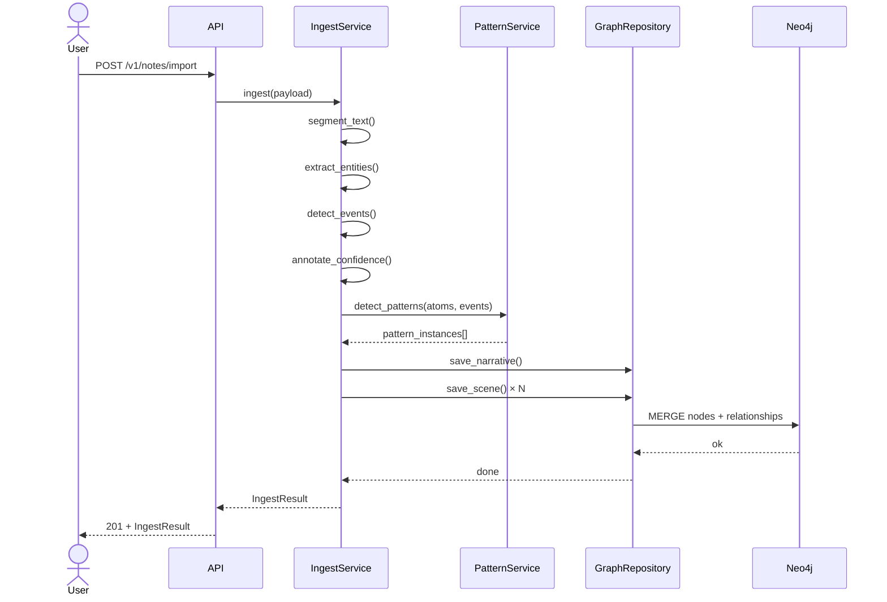
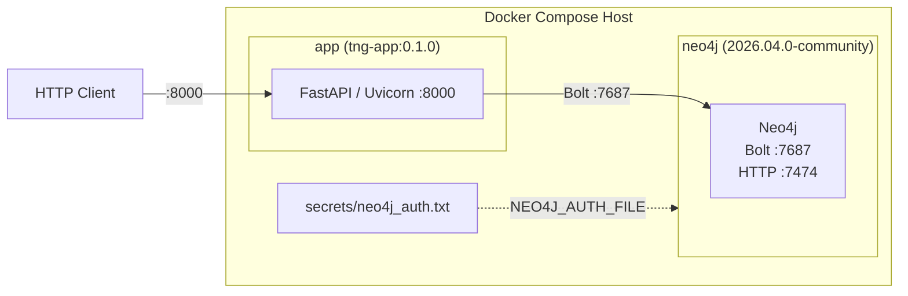

# Architecture

## Layered Design

TNGS uses a strict four-layer architecture. Each layer may only depend on the layer directly below it:

```
┌─────────────────────────────────────┐
│            REST API Layer            │  FastAPI routers, Pydantic schemas
├─────────────────────────────────────┤
│         Domain Services Layer        │  IngestService, TransformService, etc.
├─────────────────────────────────────┤
│          Repository Layer            │  GraphRepository, CypherQueries
├─────────────────────────────────────┤
│            Graph Store               │  Neo4j (Bolt :7687)
└─────────────────────────────────────┘
```

No layer may skip a level. Routers never issue Cypher; renderers never call services; services never import FastAPI.

## Component Map

```mermaid
flowchart TD
    subgraph Input["Input Layer"]
        A1[Plain text / Markdown]
        A2[JSON payload]
        A3[CSV corpus]
    end

    subgraph Ingest["Ingest Pipeline"]
        B1[Text segmenter]
        B2[Entity extractor]
        B3[Event detector]
        B4[Confidence annotator]
        B5[Pattern detector]
    end

    subgraph API["REST API — FastAPI"]
        C1[/v1/notes/import]
        C2[/v1/narratives]
        C3[/v1/patterns]
        C4[/v1/transforms/apply]
        C5[/v1/render]
        C6[/v1/health]
    end

    subgraph Domain["Domain Services"]
        D1[IngestService]
        D2[PatternService]
        D3[TransformService]
        D4[RenderService]
    end

    subgraph Repo["Repository Layer"]
        E1[GraphRepository]
        E2[CypherQueries]
    end

    subgraph Store["Graph Store"]
        F1[(Neo4j)]
    end

    A1 & A2 & A3 --> C1
    C1 --> D1 --> B1 & B2 & B3 & B4 & B5
    B1 & B2 & B3 & B4 & B5 --> E1
    C2 & C3 --> D2 --> E1
    C4 --> D3 --> E1
    C5 --> D4 --> E1
    E1 --> E2 --> F1
    C6 --> F1
```

## Ingest Pipeline

The ingest pipeline runs entirely in memory before any graph write. This guarantees the graph is never left in a partially-atomized state.



## Deployment Topology



## Design Patterns Used

| Pattern | Location | Purpose |
|---------|----------|---------|
| **Repository** | `GraphRepository` | Abstracts all Cypher; no raw queries leak into services |
| **Service Layer** | `*Service` classes | Encapsulates business logic; services are the only callers of the repository |
| **Strategy** | `RendererProtocol`, `PatternMatcher` | Pluggable renderers and pattern matchers via Python Protocols |
| **Factory / DI** | `dependencies.py` | FastAPI dependency providers; overridden in tests |
| **DTO** | `api/schemas.py` | Request/response models are separate from domain models |
| **Value Object** | All enumerations | Bounded vocabularies enforced at the type level |

## Security Boundaries

- All API input is validated by Pydantic before reaching any service
- All Cypher parameters are driver-parameterised (never string-interpolated)
- Secrets are injected via Docker secrets file, never environment variables or source
- The Neo4j HTTP port (7474) must not be exposed to the public internet in production
