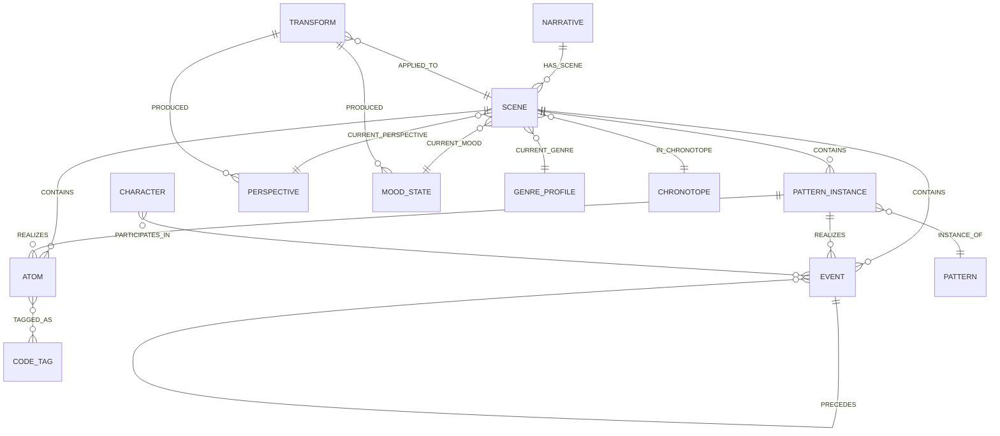

# Data Model

## Node Labels

| Label | Key Properties | Purpose |
|-------|---------------|---------|
| `Narrative` | `id`, `title`, `status`, `source_ref` | Top-level work or draft |
| `Scene` | `id`, `sequence`, `summary` | Bounded narrative segment |
| `Atom` | `id`, `text`, `kind`, `surface_order`, `confidence` | Minimal expressive unit |
| `Event` | `id`, `verb`, `tense`, `aspect`, `confidence` | Action-bearing unit |
| `Character` | `id`, `name`, `role` | Participants and focalizers |
| `Pattern` | `id`, `name`, `family`, `description` | Reusable narrative template |
| `PatternInstance` | `id`, `slot`, `confidence` | Concrete realisation of a Pattern |
| `Perspective` | `id`, `focalizer`, `distance`, `reliability` | POV state at a transform point |
| `MoodState` | `id`, `label`, `valence`, `arousal` | Affective/tonal state |
| `GenreProfile` | `id`, `name`, `conventions` | Genre encoding |
| `Chronotope` | `id`, `time_mode`, `space_mode` | Bakhtinian time-space frame |
| `CodeTag` | `id`, `code`, `label` | Barthesian code attachment |
| `Transform` | `id`, `axis`, `operator`, `applied_at`, `parameters` | Transformation audit record |

## Relationships

| Relationship | From → To | Meaning |
|-------------|-----------|---------|
| `HAS_SCENE` | Narrative → Scene | Narrative contains this scene |
| `CONTAINS` | Scene → Atom / Event / PatternInstance | Scene contains this unit |
| `INSTANCE_OF` | PatternInstance → Pattern | Instance realises template |
| `REALIZES` | PatternInstance → Atom / Event | Instance grounded in these units |
| `PARTICIPATES_IN` | Character → Event | Character takes part |
| `CAUSES` | Event → Event | Direct causal relation |
| `ENABLES` | Event → Event | Enabling (necessary but not sufficient) |
| `PREVENTS` | Event → Event | Blocking relation |
| `PRECEDES` | Event → Event | Temporal ordering |
| `CURRENT_PERSPECTIVE` | Scene → Perspective | Active POV |
| `CURRENT_MOOD` | Scene → MoodState | Active mood |
| `CURRENT_GENRE` | Scene → GenreProfile | Active genre |
| `IN_CHRONOTOPE` | Scene → Chronotope | Active time-space frame |
| `TAGGED_AS` | Atom → CodeTag | Barthesian code label |
| `APPLIED_TO` | Transform → Scene | Where transform was applied |
| `PRODUCED` | Transform → (state node) | What transform created |

## Entity Relationship Diagram



## Bounded Vocabularies

All semantic axes use Python enumerations (not open strings):

| Enumeration | Values |
|-------------|--------|
| `AtomKind` | descriptive, dialogic, reflexive, transitional, expository |
| `BarthesCode` | hermeneutic, proairetic, semic, symbolic, cultural |
| `FocalizationDistance` | zero, internal, external |
| `ReliabilityLevel` | reliable, unreliable, ambiguous |
| `TransformAxis` | pov, mood, genre, chronotope, reliability, code_overlay |
| `NarrativeStatus` | draft, atomized, patterned, transformed, rendered, exported, archived |

## Confidence and Review Flags

Every automatically derived node carries:
- `confidence: float` — extraction confidence in [0.0, 1.0]
- `needs_review: bool` — `True` when confidence is below the configured threshold

Items below threshold are **not discarded**. They are persisted with `needs_review=True` so human judgement can resolve ambiguity later. This is a first-class design decision, not a defect.

## Transform as a First-Class Node

The `Transform` node is the audit trail spine. It has two outgoing relationships:
- `APPLIED_TO` → the Scene it modified
- `PRODUCED` → the new state node it created

This makes transformation lineage queryable as a graph traversal:

```cypher
MATCH (t:Transform)-[:APPLIED_TO]->(s:Scene {id: $scene_id})
OPTIONAL MATCH (t)-[:PRODUCED]->(produced)
RETURN t.axis, t.operator, t.applied_at, labels(produced) AS produced_type
ORDER BY t.applied_at ASC
```
