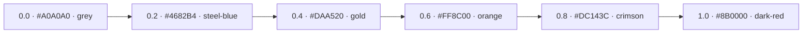
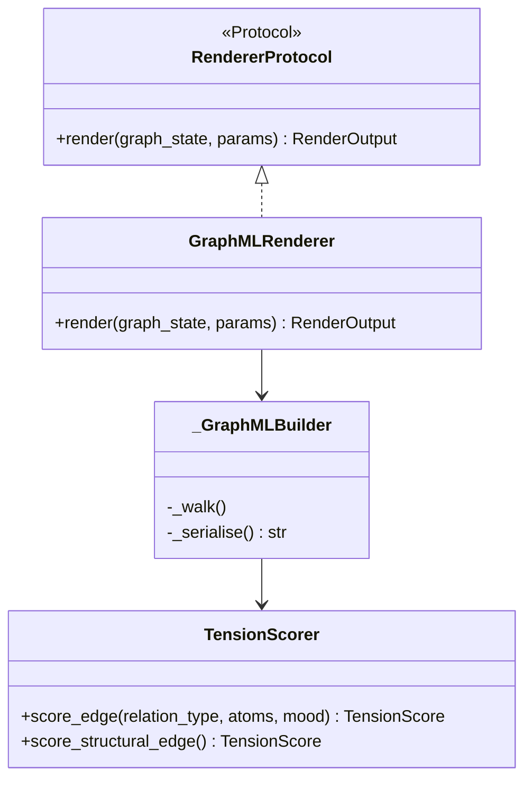

# GraphML Export

The `graphml` render type produces a [GraphML](http://graphml.graphdrawing.org/)
document that can be opened directly in [yEd Graph Editor](https://www.yworks.com/products/yed).
Edges are colored on a six-stop perceptual gradient derived from a composite
**narrative tension score**.

---

## How to export

```bash
# Start the API server
docker compose up -d

# Ingest a narrative
curl -X POST http://localhost:8000/v1/notes/import \
  -H "Content-Type: application/json" \
  -d '{"title": "My Story", "text": "Alice locked the door. Bob arrived and tried the handle. He could not enter."}'

# Export as GraphML (replace <narrative_id> with the returned ID)
curl -X POST http://localhost:8000/v1/render/<narrative_id> \
  -H "Content-Type: application/json" \
  -d '{"type": "graphml"}' \
  | jq -r '.content' > my_story.graphml
```

---

## Opening in yEd

1. Launch yEd Graph Editor (version 3.x or later).
2. **File → Open** and select `my_story.graphml`.
3. yEd reads the yFiles extension keys (`d3` for node graphics, `d6` for edge
   graphics) and applies colors automatically.
4. Use **Layout → Hierarchical** (or **Organic**) for a readable layout — yEd
   does not auto-layout on import.
5. The **Properties** panel shows each node/edge's `tension_score` attribute
   (`d8` key), useful for filtering high-tension edges.

---

## Node color legend

| Node type | Color | Hex |
|-----------|-------|-----|
| Narrative | Blue | `#4A90D9` |
| Scene | Green | `#7ED321` |
| Atom | Amber | `#F5A623` |
| Event | Red | `#D0021B` |
| PatternInstance | Purple | `#9B59B6` |
| Pattern | Dark red | `#C0392B` |
| Perspective | Teal | `#1ABC9C` |
| MoodState | Coral | `#E74C3C` |
| GenreProfile | Sky blue | `#3498DB` |
| Chronotope | Dark green | `#27AE60` |
| CodeTag | Orange | `#F39C12` |
| Transform | Grey | `#95A5A6` |
| Character | Violet | `#8E44AD` |

---

## Edge tension scoring

Tension is a composite score in **[0.0, 1.0]** combining three signals:

### 1. Relationship type (base score)

| Relationship | Base score | Rationale |
|-------------|-----------|-----------|
| `PREVENTS` | 0.9 | Highest conflict; direct opposition of agency |
| `CAUSES` | 0.7 | Strong causal force; irreversible consequence |
| `PARTICIPATES_IN` | 0.4 | Character involvement; stakes present |
| `ENABLES` | 0.4 | Facilitation; indirect force |
| `PRECEDES` | 0.2 | Temporal sequence; low inherent tension |
| Structural (`HAS_SCENE`, `CONTAINS`, etc.) | 0.0 | Containment; no narrative force |

### 2. Barthesian code modifier (additive)

Only the highest-ranking code tag in the source scene contributes, preventing
inflation from heavily-tagged scenes.

| Code | Bonus | Rationale |
|------|-------|-----------|
| `HERMENEUTIC` | +0.4 | Unresolved mystery — maximum reader tension |
| `PROAIRETIC` | +0.3 | Imminent action — suspense |
| `SYMBOLIC` | +0.2 | Thematic opposition — latent tension |
| `SEMIC` | +0.1 | Connotative load — background unease |
| `CULTURAL` | +0.0 | Shared knowledge — neutral |

### 3. Scene mood modifier (additive)

High arousal combined with negative valence produces the anxious mood profile
most associated with narrative tension.

```
mood_bonus = arousal × max(0, −valence) × 0.6
```

Maximum mood contribution: **+0.6** (arousal = 1.0, valence = −1.0).

### Final score

```
tension = clamp(base + code_bonus + mood_bonus, 0.0, 1.0)
```

---

## Edge color gradient

Six stops map the [0.0, 1.0] range to a perceptual gradient. Colors were
chosen to remain distinguishable under common forms of color-vision deficiency
(the grey → blue axis is distinguishable from grey → red for protanopia /
deuteranopia).



| Stop | Score | Color | Hex |
|------|-------|-------|-----|
| 1 | 0.0 | Grey | `#A0A0A0` |
| 2 | 0.2 | Steel blue | `#4682B4` |
| 3 | 0.4 | Goldenrod | `#DAA520` |
| 4 | 0.6 | Dark orange | `#FF8C00` |
| 5 | 0.8 | Crimson | `#DC143C` |
| 6 | 1.0 | Dark red | `#8B0000` |

Colors between stops are linearly interpolated in RGB space.

---

## Architecture

The GraphML feature follows the existing **Strategy** renderer pattern:



- **`tension_scorer.py`** — pure scoring functions; no XML or graph concerns.
- **`graphml_renderer.py`** — XML construction only; delegates tension scoring.
- Neither module issues Cypher; all data arrives as a `GraphState` snapshot
  from `RenderService`.

---

## Module reference

::: tng.renderers.graphml_renderer
::: tng.renderers.tension_scorer
