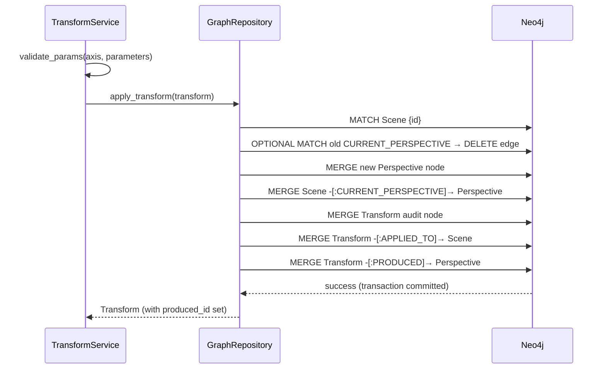
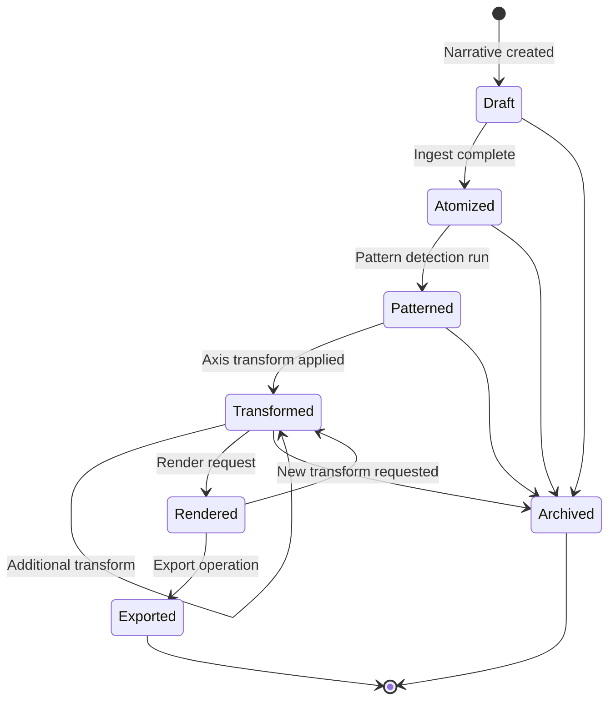

# Transformation Engine

## Overview

The transformation engine applies one of six defined axes to a scene, producing a new state node and a `Transform` audit record. Every transformation is **non-destructive**: the old state node is detached but not deleted, preserving full lineage.

## The Six Axes

| Axis | Operates On | State Node | Key Parameters |
|------|-------------|------------|----------------|
| `pov` | Scene | `Perspective` | focalizer (Character id), distance, reliability |
| `mood` | Scene | `MoodState` | label, valence [-1.0..1.0], arousal [0.0..1.0] |
| `genre` | Scene or Narrative | `GenreProfile` | name, conventions (string list) |
| `chronotope` | Scene | `Chronotope` | time_mode, space_mode |
| `reliability` | Existing Perspective | Updated `Perspective` | reliability |
| `code_overlay` | Atom | `CodeTag` | atom_id, code (Barthesian), label |

## Non-Destructive Graph Rewrite

Every transformation follows this four-step pattern:

1. Create a new state node
2. Detach the old `CURRENT_*` relationship from the Scene
3. Attach the new `CURRENT_*` relationship
4. Create a `Transform` audit node linked to the Scene and the new state node

The old state node **remains in the graph** as part of the lineage.



## Narrative State Machine



## Transformation Algebra

Transformation axes do **not** commute in general:

- Applying `pov` then `reliability` produces a Perspective node with the POV settings, then derives a second Perspective from it with updated reliability.
- Applying `reliability` then `pov` discards the reliability change because the new POV creates a fresh Perspective node.

The system does **not** enforce commutativity. It records the exact sequence in the Transform lineage. Analysts studying order effects should traverse the lineage graph directly using:

```cypher
MATCH (t:Transform)-[:APPLIED_TO]->(s:Scene {id: $scene_id})
OPTIONAL MATCH (t)-[:PRODUCED]->(produced)
RETURN t.axis, t.operator, t.applied_at, labels(produced) AS type
ORDER BY t.applied_at ASC
```

## Parameter Validation

Each axis has a dedicated Pydantic schema in `transform_service.py`. Validation happens **before any graph write**:

| Axis | Schema | Required Fields |
|------|--------|-----------------|
| `pov` | `PovParams` | `focalizer` |
| `mood` | `MoodParams` | `label` |
| `genre` | `GenreParams` | `name` |
| `chronotope` | `ChronotopeParams` | `time_mode`, `space_mode` |
| `reliability` | `ReliabilityParams` | `reliability` |
| `code_overlay` | `CodeOverlayParams` | `atom_id`, `code` |

Invalid parameters produce a `400 Bad Request` response before touching the database.
