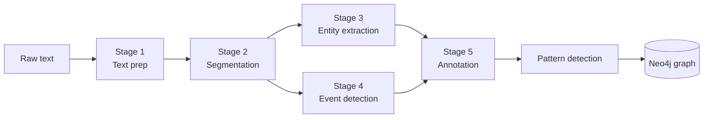
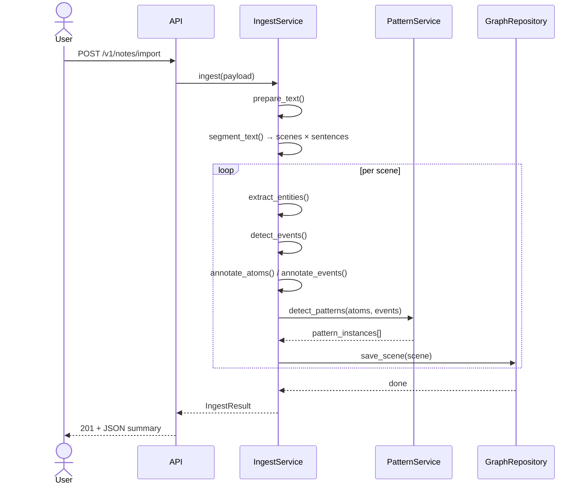

# Parsing Narratives

When you POST text to `/v1/notes/import`, TNGS runs a five-stage rule-based
pipeline entirely in memory before writing a single node to the graph.  The
pipeline requires no external NLP libraries or model downloads; it ships and
runs in CI out of the box.

---

## The five-stage pipeline



---

### Stage 1 — Text preparation

The raw input string is cleaned according to the declared `format`:

| Format | Pre-processing |
|--------|----------------|
| `text` | Strip leading/trailing whitespace |
| `markdown` | Strip YAML frontmatter (`---` block), then whitespace |
| `json` | Payload fields unpacked by the API layer before reaching the service |

After this stage the input is always a plain text string.

---

### Stage 2 — Segmentation

Two splitting rules are applied in sequence:

**Paragraphs → Scenes**

Double newlines (`\n\n` or more) mark scene boundaries.  Each paragraph
becomes one `Scene` node.  A short story with three paragraphs produces three
scenes.

**Sentences → Atoms**

Within each paragraph a regex splits on sentence-ending punctuation (`.`, `!`,
`?`) followed by optional closing punctuation and a space before an upper-case
letter, or at end-of-string:

```
(?<=[.!?])[\"']?\s+(?=[A-Z])  |  (?<=[.!?])[\"']?$
```

Each resulting sentence becomes one candidate `Atom`.

!!! example "Segmentation example"
    Input:
    ```
    Alice offered the book. She smiled.

    Bob accepted it gratefully. He nodded once.
    ```
    Output: 2 scenes, 4 atoms.

    | Scene | Sequence | Atoms |
    |-------|----------|-------|
    | Scene 1 | 1 | "Alice offered the book." · "She smiled." |
    | Scene 2 | 2 | "Bob accepted it gratefully." · "He nodded once." |

---

### Stage 3 — Entity extraction

Each scene's sentences are scanned for **consecutive capitalised words** (1–4
tokens matching `[A-Z][a-z]+`) that do *not* appear at the very start of a
sentence.  A stop-list of pronouns, conjunctions, and common sentence-initial
words filters obvious false positives.

Confidence is assigned per entity:

```
confidence = min(0.95, 0.75 + 0.05 × (mention_count − 1))
```

A single mention → 0.75 confidence.  Each additional mention raises it by
0.05, capped at 0.95.

!!! example "Entity extraction example"
    Sentences: `"Alice ran. Alice stopped. Bob arrived."`

    | Name | Mentions | Confidence |
    |------|----------|------------|
    | Alice | 2 | 0.80 |
    | Bob | 1 | 0.75 |

---

### Stage 4 — Event detection

Each sentence is scanned for a **verb phrase** using a regex that covers:

- Modal + main verb (`will run`, `should leave`)
- Be + -ing progressive (`was walking`, `is running`)
- Have + past participle (`had arrived`, `has seen`)
- Simple inflected verb (`walked`, `stops`, `running`)

The **first** match per sentence becomes a `DetectedEvent`.  Tense is
inferred from surface markers:

| Marker pattern | Tense |
|----------------|-------|
| `will`, `shall`, `going to` | future |
| `was`, `were`, `had`, `-ed` endings | past |
| Everything else | present |

All rule-based events receive a base confidence of **0.75**.

---

### Stage 5 — Confidence annotation and atom classification

The annotator wraps extracted entities and events in domain model objects with
UUIDs and applies the `confidence_threshold` (default `0.6`):

- Items **at or above** the threshold proceed normally.
- Items **below** the threshold are flagged `needs_review=True` but **are not discarded**.
  Ambiguity is first-class data; a human or downstream process resolves it.

**Atom confidence penalties:**

| Condition | Penalty |
|-----------|---------|
| Sentence shorter than 10 characters | −0.15 |
| No terminal punctuation (`.!?`) | −0.05 |

**Atom kind classification** (heuristic, in priority order):

| Kind | Trigger |
|------|---------|
| `dialogic` | Sentence starts with `"` / `'` / `"` / `"`, or contains `said`/`asked`/`replied`/`whispered`/`shouted` |
| `reflexive` | Contains `thought`/`felt`/`wondered`/`realised`/`realized`/`knew` |
| `transitional` | Starts with `then`/`later`/`meanwhile`/`afterwards`/`next`/`finally` |
| `expository` | Contains ` was a `/ ` were a `/ ` is a `/ ` are a `/ ` had been ` |
| `descriptive` | Default |

**Character–event linking:** A character is added as a `PARTICIPATES_IN`
participant if their name (case-insensitive) appears anywhere in the source
sentence of the event.

---

### Pattern detection (parallel to annotation)

After atoms and events are assembled for a scene, `PatternService` runs
keyword matching against all registered `Pattern` templates.  Matches above
the confidence threshold become `PatternInstance` nodes linked to the scene.

---

## From pipeline to graph

All in-memory results are written to Neo4j in a single pass using
idempotent `MERGE` statements.  Re-ingesting the same text leaves the graph
unchanged (no duplicate nodes).



---

## Ingest result

A successful ingest returns:

```json
{
  "narrative_id": "550e8400-e29b-41d4-a716-446655440000",
  "scene_count": 2,
  "atom_count": 4,
  "event_count": 3,
  "character_count": 2,
  "pattern_count": 1,
  "flagged_count": 0
}
```

`flagged_count` is the total number of atoms and events with
`needs_review=True`.  Review flags are queryable directly in Neo4j:

```cypher
MATCH (n:Narrative {id: $id})-[:HAS_SCENE]->(s)-[:CONTAINS]->(a:Atom)
WHERE a.needs_review = true
RETURN s.sequence AS scene, a.text, a.confidence
ORDER BY a.confidence ASC
```

---

## Replacing pipeline stages

Each stage is a Strategy.  To swap in a heavier NLP backend (spaCy, stanza,
or an LLM classifier), write a function that accepts the same inputs and
returns the same output type (`ExtractedEntity`, `DetectedEvent`, `Atom`), then
pass it to `IngestService` during construction.  No other code changes.
