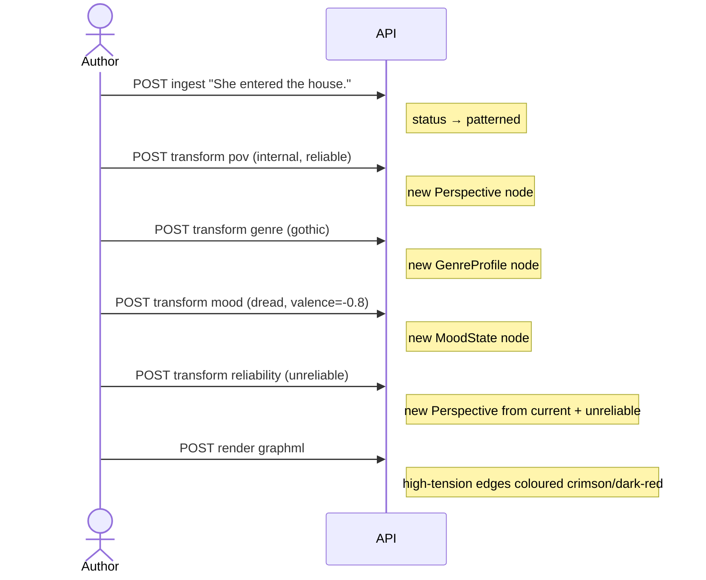

# Transforming Narratives

A **transform** is an auditable operation that alters one interpretation axis
of a scene and records the change as a `Transform` node in the graph.  Every
transform is non-destructive: the previous state node is detached but never
deleted, so the full lineage is always traversable.

---

## How to apply a transform

Two endpoints are available depending on scope:

| Endpoint | Scope |
|----------|-------|
| `POST /v1/transforms/apply` | One scene |
| `POST /v1/transforms/apply-bulk` | Every scene in a narrative |

```json
{
  "scene_id": "<scene-id>",
  "axis": "<axis-name>",
  "parameters": { ... },
  "operator": "your-name"
}
```

The `operator` field is free text — use it to record who or what issued the
transform.  It appears in the audit trail.

---

## The six axes

| Axis | What it changes | State node produced |
|------|-----------------|---------------------|
| `pov` | Who perceives — and how | `Perspective` |
| `mood` | Affective/tonal register | `MoodState` |
| `genre` | Genre conventions imposed on the scene | `GenreProfile` |
| `chronotope` | Time-space framing | `Chronotope` |
| `reliability` | Narrator/focalizer credibility | Updated `Perspective` |
| `code_overlay` | Barthesian code tag on a single atom | `CodeTag` |

---

## Use-case recipes

### 1. Shift a scene to an internal, unreliable narrator

An omniscient narrator (zero focalization, reliable) is the default.  To
recast a scene as filtered through a character's biased subjective experience:

```bash
curl -X POST http://localhost:8000/v1/transforms/apply \
  -H "Content-Type: application/json" \
  -d '{
    "scene_id": "scene-abc",
    "axis": "pov",
    "parameters": {
      "focalizer": "char-alice",
      "distance": "internal",
      "reliability": "unreliable"
    },
    "operator": "editor"
  }'
```

The graph now has:
- A new `Perspective` node: `focalizer=char-alice, distance=internal, reliability=unreliable`
- The old `Perspective` detached but still present
- A `Transform` node linking both

To later reduce just the reliability without changing the focalizer, use the
`reliability` axis — it reads the current `Perspective` and copies the
existing focalizer/distance:

```json
{
  "scene_id": "scene-abc",
  "axis": "reliability",
  "parameters": { "reliability": "ambiguous" }
}
```

!!! warning "Order matters"
    Applying `pov` after `reliability` replaces the entire Perspective, losing
    the reliability change.  Applying `reliability` after `pov` derives from the
    current Perspective and is additive.  The transform lineage records the exact
    sequence — query it to reason about order effects.

---

### 2. Re-stage a scene in a gothic genre

Layering genre conventions onto a scene signals to downstream renderers and
readers what obligations the scene should satisfy:

```bash
curl -X POST http://localhost:8000/v1/transforms/apply \
  -H "Content-Type: application/json" \
  -d '{
    "scene_id": "scene-abc",
    "axis": "genre",
    "parameters": {
      "name": "gothic",
      "conventions": [
        "atmosphere of dread and decay",
        "isolated setting cut off from ordinary society",
        "a hidden or suppressed secret"
      ]
    },
    "operator": "author"
  }'
```

Combine with a mood transform to reinforce the effect:

```bash
curl -X POST http://localhost:8000/v1/transforms/apply \
  -H "Content-Type: application/json" \
  -d '{
    "scene_id": "scene-abc",
    "axis": "mood",
    "parameters": {
      "label": "dread",
      "valence": -0.8,
      "arousal": 0.6
    },
    "operator": "author"
  }'
```

`valence` in `[-1.0, 1.0]` (negative = negative affect) and `arousal` in
`[0.0, 1.0]` (high = energetic/activated).  These values also feed the
[narrative tension score](../design/graphml-export.md) used in the GraphML export.

---

### 3. Adjust the time-space frame (chronotope)

A **road-novel** scene has an open, linear chronotope.  A fairy-tale opening
has a bounded, cyclical one.  To remap a scene's time-space frame:

```bash
curl -X POST http://localhost:8000/v1/transforms/apply \
  -H "Content-Type: application/json" \
  -d '{
    "scene_id": "scene-abc",
    "axis": "chronotope",
    "parameters": {
      "time_mode": "suspended",
      "space_mode": "liminal"
    },
    "operator": "researcher"
  }'
```

Valid values:

| Parameter | Options |
|-----------|---------|
| `time_mode` | `cyclical` · `linear` · `suspended` · `compressed` |
| `space_mode` | `bounded` · `open` · `liminal` · `utopian` |

---

### 4. Mark an atom with a narrative code

Barthesian code overlays tag individual atoms — the minimal units of text —
with a code that signals their narrative function.  You need the atom's ID
(returned from a graph query or the JSON render):

```bash
# First, find the atom IDs from the JSON render
curl -X POST http://localhost:8000/v1/render/<narrative-id> \
  -H "Content-Type: application/json" \
  -d '{"type": "json"}' | jq '.content | fromjson | .narrative.scenes[].atoms[] | {id, text}'

# Then apply the code overlay
curl -X POST http://localhost:8000/v1/transforms/apply \
  -H "Content-Type: application/json" \
  -d '{
    "scene_id": "scene-abc",
    "axis": "code_overlay",
    "parameters": {
      "atom_id": "atom-xyz",
      "code": "hermeneutic",
      "label": "The locked door — what is behind it?"
    },
    "operator": "analyst"
  }'
```

| Code | Meaning |
|------|---------|
| `hermeneutic` | Mystery or enigma creating reader anticipation (+0.4 tension) |
| `proairetic` | Action implying a consequent action (+0.3 tension) |
| `symbolic` | Binary or antithetical thematic opposition (+0.2 tension) |
| `semic` | Connotative detail building character or atmosphere (+0.1 tension) |
| `cultural` | Reference to shared knowledge or convention (0 tension) |

---

### 5. Compare two narrative versions

Apply different transforms to two separate ingest runs of the same source
text, then render each as `diff` to see what changed per axis:

```bash
# Render the transformation diff
curl -X POST http://localhost:8000/v1/render/<narrative-id> \
  -H "Content-Type: application/json" \
  -d '{"type": "diff"}'
```

The diff renderer returns a JSON document grouped by axis, showing the before
and after state for every scene that has been transformed.

---

## Querying transform lineage

Every transform is permanently recorded in the graph.  To retrieve the full
transform history for a scene, ordered chronologically:

```cypher
MATCH (t:Transform)-[:APPLIED_TO]->(s:Scene {id: $scene_id})
OPTIONAL MATCH (t)-[:PRODUCED]->(produced)
RETURN t.axis        AS axis,
       t.operator    AS operator,
       t.applied_at  AS applied_at,
       t.parameters  AS parameters,
       labels(produced) AS produced_type
ORDER BY t.applied_at ASC
```

To find every scene that has been given an `unreliable` perspective:

```cypher
MATCH (s:Scene)-[:CURRENT_PERSPECTIVE]->(pov:Perspective {reliability: "unreliable"})
RETURN s.id, pov.focalizer
```

To trace what a specific operator has changed across all narratives:

```cypher
MATCH (t:Transform {operator: "editor"})
MATCH (t)-[:APPLIED_TO]->(s:Scene)
MATCH (n:Narrative)-[:HAS_SCENE]->(s)
RETURN n.title, s.id, t.axis, t.applied_at
ORDER BY t.applied_at DESC
```

---

## Bulk transforms — applying an axis to an entire narrative

When the same transformation applies to every scene (setting a baseline mood,
shifting genre, or marking the whole narrative as unreliable), use the bulk
endpoint instead of looping over scene IDs manually.

```bash
POST /v1/transforms/apply-bulk
```

```json
{
  "narrative_id": "my-narrative-id",
  "axis": "mood",
  "parameters": { "label": "dread", "valence": -0.75, "arousal": 0.6 },
  "operator": "analyst"
}
```

Response:

```json
{
  "narrative_id": "my-narrative-id",
  "applied_count": 4,
  "results": [
    { "scene_id": "s-1", "axis": "mood", "status": "accepted", "transform_id": "…", "produced_id": "…" },
    { "scene_id": "s-2", "axis": "mood", "status": "accepted", "transform_id": "…", "produced_id": "…" },
    { "scene_id": "s-3", "axis": "mood", "status": "accepted", "transform_id": "…", "produced_id": "…" },
    { "scene_id": "s-4", "axis": "mood", "status": "accepted", "transform_id": "…", "produced_id": "…" }
  ]
}
```

`applied_count` equals the number of scenes in the narrative. Each scene gets
its own `Transform` audit node, exactly as if you had called `/apply`
individually. The audit trail is identical either way.

!!! note "Parameters are validated once"
    The axis parameter schema is validated before any write occurs. An invalid
    parameter dict returns `400` and leaves the graph unchanged.

!!! warning "`code_overlay` is atom-scoped and cannot be used with apply-bulk"
    The `code_overlay` axis requires an `atom_id` — it targets a single atom,
    not a scene. Sending it to `apply-bulk` returns `400`.

---

## Revising atom text

Transforms change the *interpretation* of a scene — POV, mood, genre. To change
the *words themselves*, use the atom revision endpoint.

```bash
PATCH /v1/atoms/{atom_id}
```

```json
{
  "text": "She hesitated at the threshold, then stepped inside.",
  "operator": "editor",
  "reason": "strengthen the beat"
}
```

Response:

```json
{
  "atom_id": "atom-…",
  "revision_id": "rev-…",
  "text": "She hesitated at the threshold, then stepped inside."
}
```

The revision is **non-destructive**: the original atom text is kept in the graph
under `HAS_REVISION`. All renderers automatically use the latest revision via a
`CURRENT_REVISION` relationship — no further changes needed.

The full revision chain is always accessible:

```bash
GET /v1/atoms/{atom_id}/revisions
```

```json
{
  "atom_id": "atom-…",
  "revisions": [
    {
      "id": "rev-001",
      "text": "She hesitated at the threshold, then stepped inside.",
      "revised_at": "2026-04-26T14:32:00",
      "operator": "editor",
      "reason": "strengthen the beat"
    }
  ]
}
```

To find an atom's ID, use the JSON render and filter by text:

```bash
curl -sX POST http://localhost:8000/v1/render/<narrative-id> \
  -H "Content-Type: application/json" \
  -d '{"type":"json"}' \
  | jq -r '.content | fromjson | .narrative.scenes[].atoms[]
    | select(.text | test("hesitated|threshold"))
    | {id, text}'
```

In Neo4j, query the revision chain directly:

```cypher
MATCH (a:Atom {id: $atom_id})-[:HAS_REVISION]->(r:AtomRevision)
RETURN r.text, r.revised_at, r.operator, r.reason
ORDER BY r.revised_at ASC
```

---

## Combining transforms: a worked example

Starting from a plain ingest of a two-scene story, apply a sequence of
transforms to build a gothic, first-person, unreliable narration:



The Transform lineage for Scene 1 after this sequence contains four nodes,
linked in order, each pointing to the state node it produced.  None of the
earlier state nodes has been deleted.
