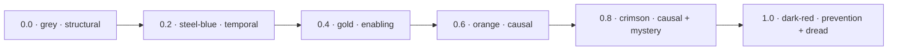
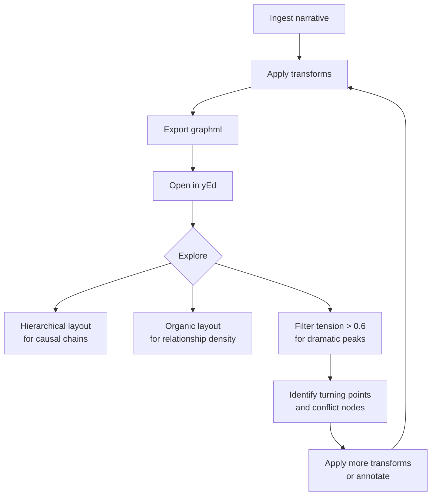

# Reading the Graph in yEd

The `graphml` render type exports the narrative graph as a
[GraphML](http://graphml.graphdrawing.org/) document that yEd Graph Editor
reads natively.  Nodes are colored by label type; edges are colored by
**narrative tension score** on a six-stop gradient.

---

## Step 1 — Export the GraphML file

```bash
curl -X POST http://localhost:8000/v1/render/<narrative-id> \
  -H "Content-Type: application/json" \
  -d '{"type": "graphml"}' \
  | jq -r '.content' > narrative.graphml
```

This writes a UTF-8 GraphML XML file to `narrative.graphml`.

---

## Step 2 — Open in yEd

1. Download and install [yEd Graph Editor](https://www.yworks.com/products/yed)
   (free, available for macOS, Windows, Linux).
2. Launch yEd.
3. Choose **File → Open** and navigate to `narrative.graphml`.
4. yEd reads the yFiles extension keys embedded in the file (`d3` for node
   graphics, `d6` for edge graphics) and applies node fill colors and edge
   line colors automatically — no manual styling needed.

!!! note "yEd version"
    yEd 3.x or later is required.  The file uses yFiles XML extension schema
    keys that are not present in the plain GraphML specification.

---

## Step 3 — Apply a layout

yEd does not auto-layout on import.  After opening the file:

- **Layout → Hierarchical** — best for causal chains and temporal sequences;
  arranges nodes top-to-bottom by dependency.
- **Layout → Organic** — best for exploring relationship density; clusters
  tightly connected nodes together.
- **Layout → Tree → Balloon** — useful for seeing Narrative → Scene → Atom
  containment hierarchies.

Apply with **F5** (re-run last layout) after any edit.

---

## Node color reference

Each node type has a distinct fill color for immediate visual identification:

| Node type | Color | Hex |
|-----------|-------|-----|
| Narrative | Blue | `#4A90D9` |
| Scene | Green | `#7ED321` |
| Atom | Amber | `#F5A623` |
| Event | Red | `#D0021B` |
| PatternInstance | Purple | `#9B59B6` |
| Pattern | Dark red | `#C0392B` |
| Perspective | Teal | `#1ABC9C` |
| MoodState | Coral | `#E74C3C` |
| GenreProfile | Sky blue | `#3498DB` |
| Chronotope | Dark green | `#27AE60` |
| CodeTag | Orange | `#F39C12` |
| Transform | Grey | `#95A5A6` |
| Character | Violet | `#8E44AD` |

---

## Edge color reference — narrative tension

Edges are colored by a composite **tension score** in `[0.0, 1.0]`.  The
gradient runs from neutral grey (structural/containment edges) through steel
blue and gold to dark red (maximum conflict or prevention under negative mood).



| Color | Score | Relationship types at this level |
|-------|-------|----------------------------------|
| Grey `#A0A0A0` | 0.0 | `HAS_SCENE`, `CONTAINS`, `INSTANCE_OF`, `TAGGED_AS` |
| Steel blue `#4682B4` | 0.2 | `PRECEDES` |
| Goldenrod `#DAA520` | 0.4 | `ENABLES`, `PARTICIPATES_IN` |
| Orange `#FF8C00` | 0.6 | `CAUSES` |
| Crimson `#DC143C` | 0.8 | `CAUSES` with a mystery code tag |
| Dark red `#8B0000` | 1.0 | `PREVENTS` under high-arousal negative mood |

Colors between these stops are linearly interpolated.  A `PREVENTS` relation
in a scene with `valence=-1.0, arousal=1.0` and a `hermeneutic` code tag on
the source atom will score close to 1.0.

---

## Using the Properties panel

Click any node or edge to open its properties in the **Properties** panel
(bottom of the window by default).

**Useful properties to inspect:**

- **Nodes** — the label shows the node type and key text (e.g., "Atom: She
  walked slowly."; "POV: Alice").
- **Edges** — the `tension_score` attribute (`d8` key) shows the exact score
  as a decimal, useful for sorting or filtering programmatically.

To see all properties: right-click a node → **Properties...** or use the
**Edit → Properties** menu.

---

## Filtering high-tension edges

To isolate the most dramatically loaded parts of the graph:

1. **Edit → Find / Add** (Ctrl+F) → switch to the **Edges** tab.
2. Filter by `tension_score > 0.6` — this surfaces `CAUSES` and `PREVENTS`
   relations that carry meaningful narrative force.
3. Use **View → Show/Hide Non-Matching** to dim the low-tension structural
   edges.

Alternatively, export a filtered version programmatically:

```cypher
-- Query all high-tension event relations for a narrative
MATCH (n:Narrative {id: $id})-[:HAS_SCENE]->(s)-[:CONTAINS]->(src:Event)
MATCH (src)-[r:CAUSES|PREVENTS]->(tgt:Event)
RETURN src.verb, type(r), tgt.verb, s.id AS scene
ORDER BY type(r), src.verb
```

---

## Typical analysis workflow



---

## What the graph reveals

| Visual pattern | Narrative meaning |
|----------------|-------------------|
| Cluster of dark-red / crimson edges | Dramatic conflict zone — high prevention or causal force |
| Many grey edges, few colored ones | Structurally flat section — low event density |
| `Perspective` node with dashed style | Scene has been re-focalized at least once |
| Multiple `Transform` nodes linked to one `Scene` | That scene has been worked over heavily |
| Long `PRECEDES` chain (blue) | Linear temporal sequence — classic plot progression |
| `CodeTag` (orange) attached to many `Atom` nodes | The author has annotated this scene heavily for symbolic or hermeneutic content |
