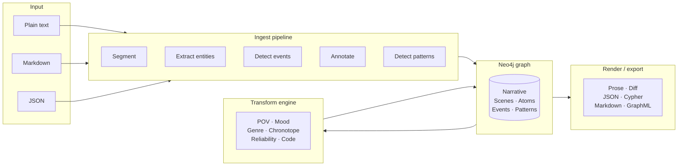

# Transformable Narrative Graph System

**TNGS** is a graph-native software system for representing, transforming, and rendering literary narratives. It stores narratives as property graphs in Neo4j and applies auditable literary transformations along six axes — point of view, mood, genre, time-space framing, narrator reliability, and narrative code overlay.

---

## Quick start

```bash
# 1. Create the Neo4j credentials secret
mkdir -p secrets
echo "neo4j/CHANGE_ME_BEFORE_DEPLOY" > secrets/neo4j_auth.txt

# 2. Start the full stack
docker compose up -d --build

# 3. Wait for the health check to pass
curl http://localhost:8000/v1/health/ready

# 4. Ingest your first narrative
curl -X POST http://localhost:8000/v1/notes/import \
  -H "Content-Type: application/json" \
  -d '{
    "title": "The Gift",
    "text": "Alice offered the book. She smiled.\n\nBob accepted it gratefully."
  }'

# 5. Open interactive API docs
open http://localhost:8000/docs
```

---

## What TNGS does



---

## Core concepts

| Concept | Description |
|---------|-------------|
| **Atom** | The minimal expressive unit — a single clause or sentence |
| **Event** | An action-bearing unit with verb, tense, aspect, and participants |
| **Pattern** | A reusable narrative template (ritual, conflict, revelation, etc.) |
| **Transform** | A non-destructive, auditable graph operation on one interpretation axis |
| **Perspective** | Genettean focalization: zero (omniscient), internal, or external |
| **Chronotope** | Bakhtinian time-space frame: time mode × space mode |
| **CodeTag** | Narrative code attached to an atom: hermeneutic, proairetic, semic, symbolic, cultural |

---

## Transformation axes

| Axis | What it changes | State node |
|------|-----------------|------------|
| `pov` | Who perceives — and how | `Perspective` |
| `mood` | Affective/tonal register | `MoodState` |
| `genre` | Genre conventions on the scene | `GenreProfile` |
| `chronotope` | Time-space framing | `Chronotope` |
| `reliability` | Narrator/focalizer credibility | Updated `Perspective` |
| `code_overlay` | Narrative code on a single atom | `CodeTag` |

All transforms are **non-destructive**: the old state node is detached but never deleted. The full transformation lineage is always traversable in the graph.

---

## Guide

| | |
|---|---|
| [Parsing Narratives](guide/parsing.md) | How the ingest pipeline segments text into atoms, extracts entities and events, assigns confidence, and writes the graph |
| [Transforming Narratives](guide/transforming.md) | Use-case recipes for POV shifts, genre changes, mood adjustments, code overlays, and transform sequences |
| [Output and Rendering](guide/output.md) | All six render formats — prose, diff, JSON, Cypher, Markdown, and GraphML — with curl examples |
| [Reading the Graph in yEd](guide/yed.md) | Opening the GraphML export in yEd, applying layouts, reading node/edge colors, and filtering by tension score |

---

## Design documentation

| | |
|---|---|
| [Architecture](design/architecture.md) | Layered design, component map, deployment topology, and security boundaries |
| [Data Model](design/data-model.md) | Node labels, relationships, bounded vocabularies, and confidence flags |
| [Transformation Engine](design/transformation-engine.md) | Non-destructive graph rewrites, transform algebra, state machine |
| [GraphML Export](design/graphml-export.md) | Tension scoring tables, color gradient, yEd key declarations |

---

## API documentation

Interactive Swagger UI is available at `http://localhost:8000/docs` when the server is running. Full endpoint reference: [API Reference](api/reference.md).
